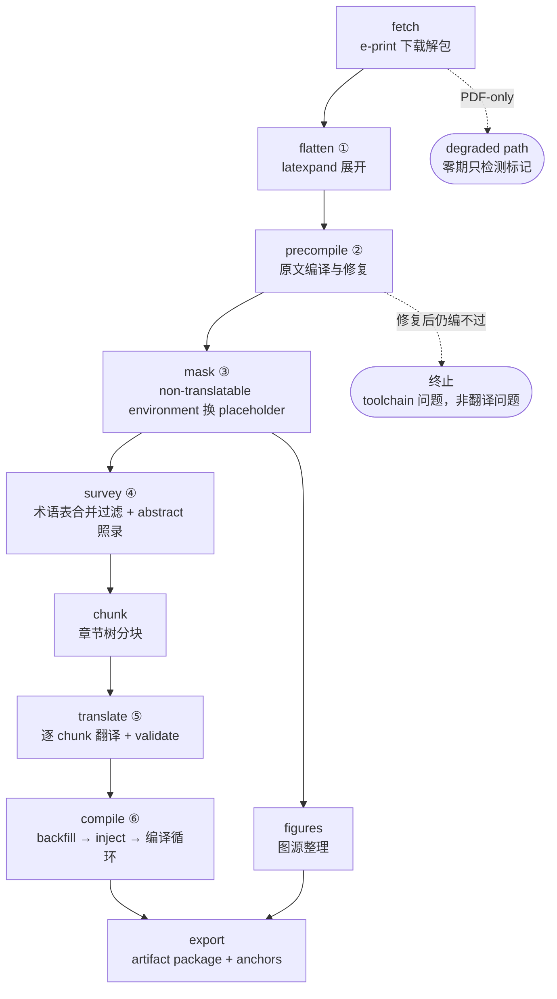
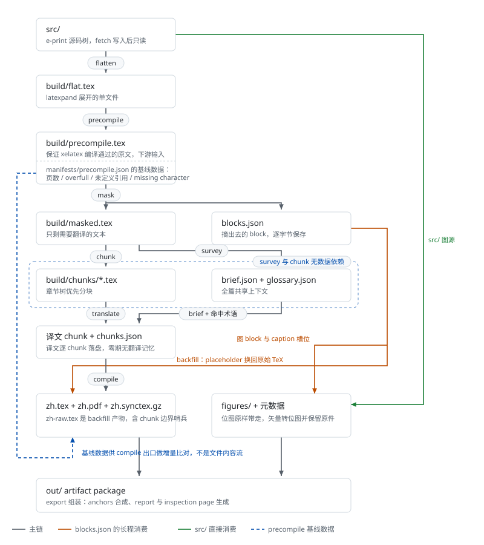
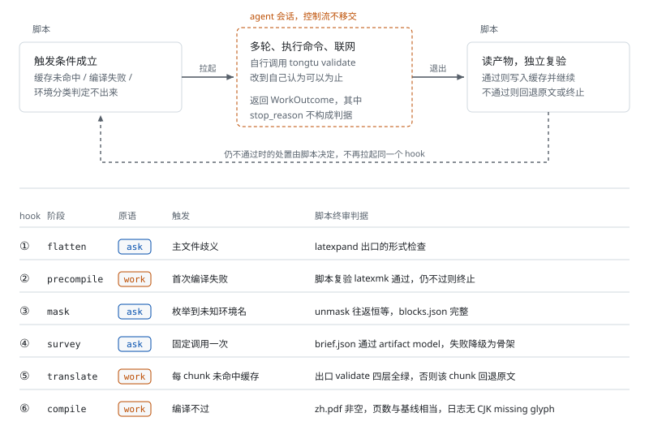

# 通途（Tongtu）架构文档

## 1. 定位与范围

通途是基于 LaTeX 源码的 arXiv 论文英译中引擎：确定性 pipeline + agent 翻译 + 脚本校验 + 编译循环，产出保真排版的中文 PDF 与结构化索引（`paper.json`，§5）。

## 2. 设计原则

1. **agent 负责智能，程序负责验证**。翻译、修编译错、适配非常规 documentclass 交给 agent；正确性只认校验脚本全绿与编译通过。
2. **pipeline 是增量构建系统**。每阶段输出 = 输入（源码 + 配置 + 术语表 + prompt 版本 + 模型）；输入未变不重算；LLM 输出有不确定性，同样的输入可能有不同的输出，这部分按输入 hash 判定是否命中缓存。
3. **使用 Pipeline 进行推进**。脚本只在固定 stage 启动 agent，agent 会话内部不限制其行为（多轮、执行命令、联网），结束判定一律是脚本校验。一次性问题由 agent 在会话内就地解决，只记入 report；反复出现的问题**固化**为确定性代码或 SKILL 经验条目，判断条件是 report.json 的干预统计。
4. **构建状态也是数据**（「会话 = 数据」的推广）。增量重翻所需状态（翻译记忆）随 artifact package 走，可在任何新环境续跑；工作目录的 `build/` 随时可丢。范围注明：随包走的构建状态只有翻译记忆；编译修复会话的成果零期不持久化，重编译 = 重新拉起修复会话（§4，附录 A.21）。零期连翻译记忆也不做，本条描述的是设计而非当前实现（附录 A.33）。
5. **纯本地操作**。通途只读写本地工作目录、stdout 与退出码；R2 上传、容器调度、任务队列全部是 wenshu 侧职责。接口形态固定为「文件 + CLI 约定」。

## 3. pipeline



带圈数字是 agent hook（见下表）。

上图是阶段序列。下图是同一条 pipeline 的 artifact 数据流，逐阶段标出读写的文件，并标出三条跨越多个阶段的依赖：`blocks.json` 从 mask 一直用到 compile 与 figures，`src/` 被 figures 直接读取，precompile 的基线数据到 compile 出口才被比对。



**所有阶段都由脚本驱动。** 脚本拉起 agent 只有两个原语，签名与约束见下文 agent 适配层节：

- `ask(prompt, text, model, schema, log_path, effort) -> AskOutcome`：单次问答，API 直调，无工具、无状态，用于主文件判定、环境分类、术语决策与逐 chunk 翻译。
- `work(prompt, workdir, model, budget, trace_path) -> WorkOutcome`：多轮会话，agent CLI 运行时拉起，可读写 workdir、执行命令、联网，用于各类修复。

表中「agent」指：该阶段的脚本在特定触发条件下拉起一次有明确结束判定的 agent 调用，拿回结果后由脚本校验与推进，控制流不移交。「结束判定」一列是每个阶段完成与否的判定条件；有 agent 调用的阶段，这一判定同样由脚本做出。

| 阶段 | 描述 | agent（触发 → 授权） | 结束判定 |
|---|---|---|---|
| [fetch](stages/fetch.md) | e-print 下载解包；PDF-only 检测 | — | 源码树落 `src/`（PDF-only → 报错标记 degraded path） |
| [flatten](stages/flatten.md) | latexpand 展开 | 主文件歧义 → 判定主文件 ① | 单文件 `flat.tex` |
| [precompile](stages/precompile.md) | latexmk 编译原文，编不过则修复到通过；产出下游输入 `precompile.tex`，基线数据（页数与三类日志计数）写入 `build/manifests/precompile.json` | 编译失败 → 修复会话 ②（源码与引擎的不匹配，`work`） | 原文编译通过（必要时经修复会话，脚本复验终审）；复验仍失败 → 终止（引擎或源码问题，非翻译问题） |
| [mask](stages/mask.md) | 把 non-translatable environment、注释、caption 换成 placeholder，产出**掩码文本**（`masked.tex`：placeholder 与待译文本相间的单一字符序列，chunk 首尾相接拼起来逐字符等于它） | 未知环境 → text/non-translatable environment 分类 ③；不确定 → 保守整体掩码 | `unmask(mask(x)) == x` 恒等；`blocks.json` 完整 |
| [survey](stages/survey.md) | 三层 input glossary 合并、按全文命中过滤成 resolved glossary；abstract 照录、章节标题树扫出，一并成 `brief.json`。均为确定性操作，产物供 translate 消费 | 术语预扫与新词译法决策 ④（`ask`，推迟，重启条件见 stages/survey.md） | resolved glossary 与 `brief.json` 落盘并通过 artifact model 校验，合并不变量成立 |
| [chunk](stages/chunk.md) | 章节树优先分块：首选标题层级划出的一节即一个 chunk，超过 `SPLIT_ABOVE` 的节向深层下分，不足 `MERGE_BELOW` 的碎片与相邻 chunk 合并；不切入不透明环境与段落内部（透明环境与切点定义见 stages/chunk.md） | — | chunk 文件与 manifest 落盘；按序拼接逐字符等于 masked.tex |
| translate | chunk 循环、上下文组装、缓存查询；每个 chunk 一次 `ask` 调用，脚本驱动 validate 与重试 | 单 chunk 翻译（`ask` 原语，脚本驱动重试）⑤ | validate 全绿（placeholder / control sequence multiset / 括号与 inline math / 段落数） |
| [compile](stages/compile.md) | 脚本 backfill 与 inject 出一份可编译的起点，编译一次跑出口判据，不过则交给修复会话 | 编译或判据不过 → 修复会话 ⑥（`work`，cwd 是编译树） | 五条判据全过：编译退出码 0、`zh.pdf` 非空、页数落在基线的固定比例区间、CJK 缺字形计数为 0、正文控制序列相对 backfill 产物只增不减 |
| figures | 图源整理：位图原样带走，矢量转位图并保留原件；caption 与引用段落收集。**只读 `src/` 与 `blocks.json`，不依赖翻译侧 artifact，可同时跑** | — | 图文件 + 元数据齐全 |
| export | artifact package 组装；anchors 三来源（synctex / blocks / pdf-scan）合成；结构化索引 `paper.json` 组装；caption 译文并入 figures 元数据；inspection page 生成；artifact model 自校验 | — | 全部 JSON artifact 通过 artifact model 校验 |

六个涉及到 agent 的 stage（主文件、toolchain、环境分类、读全文与术语、翻译、适配与修复）用于覆盖论文之间的少见差异。**阶段图对所有论文相同**，PDF-only 在顶层分支到 degraded path，阶段序列本身不重排。

### agent 适配层 —— 两个原语，两种传输

代码在 `agent/` 子模块。两个原语分属两种传输，各自独立可替换：`ask` 走 API 直调（OpenCode Go，附录 C），`work` 走 agent CLI 运行时（首发 Claude Code CLI，附录 C）。流水线只依赖这层接口：

```
ask(prompt, text, model, schema, log_path, effort) -> AskOutcome
    # 单次问答：主文件判定、环境分类、读全文与术语决策、逐 chunk 翻译。
    # prompt 作系统提示词，text 作待处理文本，一次请求一次响应；
    # 无工具、无状态，输出只是输入的函数（模型自身的随机性除外）。
    # schema（JSON Schema）给出时映射为服务端结构化输出约束（response_format）。
    # effort 是推理强度，不给则由服务端取默认档；翻译类调用一律取 low（models.md）。
    # 端点家族按模型分派：多数模型走 chat/completions，muse-spark 系列走 responses，
    # 两者的请求形态、响应形状与 usage 字段名都不同，差异记在 models.md。

AskOutcome:
    status   # ok | error
    text     # ok 时为返回正文；schema 给出时是符合该 schema 的 JSON 字符串
    detail   # 仅 error 时非空：失败现场，进 manifest

work(prompt, workdir, model, budget, trace_path) -> WorkOutcome
    # 多轮会话：修 toolchain、修编译错、documentclass 适配。
    # 要求：headless 拉起、读写 workdir、执行命令、联网、可指定模型。

WorkOutcome:
    stop_reason   # finished | budget_exhausted | timeout | error
    detail        # 仅 error 时非空：运行时的错误现场，进 report
```

上表按阶段列结束判定，下图按 hook 列同一件事，并给出六个 hook 共同的调用形状：脚本判断触发条件、拉起 agent、agent 在会话内自行行动、脚本读产物独立复验。



两者的差别不止于有无状态：`ask` 要的是纯函数式判断，一次 API 调用即可承载；`work` 要的是能读写工作目录并执行命令的会话运行时。`work` 多出的 `budget` 参数对应的正是会话才有的轮数与墙钟上限。

- `work` 的 `stop_reason` 只说明会话如何终止，**不表示修好了**；终审权在事后的校验脚本与编译，不采信 agent 的自述。各运行时自己的终止原因由适配层映射到这四个值，映射不上的归 `error`，现场写进 `detail`。
- **`ask` 的纯函数约束由构造成立**：API 直调的请求里不存在工具，也没有会话状态，输出只能是入参的函数——§4 的缓存 key 正按这个假设建立（hook④ 接线后 survey 的术语决策进 resolved glossary，命中词条进每个 chunk 的翻译 key）。若 `ask` 能读工作目录里的文件，这个假设即被破坏；选型从「与 `work` 同走运行时」改为 API 直调的决策见附录 A.25。
- 翻译场景下脚本调 `ask` 拿回译文，自行跑 validate，不通过则带校验错误信息重新 `ask`，至多重试若干次；仍不通过则该 chunk 回退原文（translate 节）。
- 编译场景下 agent 的现场是编译树 `build/zh/`，可自由读写树内文件、执行命令，与 precompile 的修复会话同形态；只有编译一次经 `tongtu tex compile`，理由是参数统一而非权限（compile 节，决策见附录 A.36）。
- **日志路径由脚本决定，日志由适配层写**：`logs/` 是工作目录布局的一部分（§5），文件名按 hook、chunk 与尝试次数拼出，以入参交给适配层（`ask` 的 `log_path`、`work` 的 `trace_path`）——重试、usage 与终止原因只有适配层知道。`ask` 的调用日志是单个 JSON 文件：请求要素、返回正文、usage、finish_reason 与耗时，失败的调用同样落日志。`work` 的会话 trace 内容是 start-state hash + command sequence（参数、返回、耗时与 token）+ end-state hash，既是审计记录，也是固化规则（§2 原则 3）的原料。
- **用量不进返回值**：每次调用的 token 与耗时落 `logs/`（`ask` 的调用日志、`work` 的 trace），export 组装 report 时从 `logs/` 汇总一次。两个原语的用量口径因此统一在一处；各阶段是独立进程，日志文件跨得过进程边界，进程内的累计对象跨不过。
- **MockAgent**：`ask` 无 schema 时原样返回 `text`，给出 schema 时返回按 schema 生成的确定性默认对象（strict 约束下原样返回不符合形状）；`work` 在翻译场景把原文写到译文路径，在编译场景调一次 `tex compile` 后退出。当前无消费者——CI 的编译层跑的是原文编译，不进翻译路径，不经 agent；MockAgent 的第一个消费者是全流水线的 identity translation，待 survey 起各阶段建成后接线。

### translate —— 逐 chunk 翻译，结构一致由 validation 判定

> 设计权威在 [stages/translate.md](stages/translate.md)，本节是摘要与跨节引用。

**要解决的问题**：把每个 chunk 译成中文，同时保证译文与原文结构完全一致。placeholder 少一个、control sequence 多一个、两段被并成一段，backfill 之后都会编译失败或丢内容，而模型的「我检查过了」在这里没有效力。

**输入 → 输出**：chunk + brief + terms + neighbors → 译文 chunk + `build/translated/<id>.tex` + `build/manifests/translate.json`。brief 与 resolved glossary 都是 survey 阶段的产出（[stages/survey.md](stages/survey.md)）；`style` 随 resolved glossary 一起进来，原样进提示词。

**翻译用 `ask`，重试归脚本，终审归脚本**：

```
chunk 循环 → 跳过判定（translatable_chars == 0 → 原文即译文）
           → 组装上下文 → ask(hook⑤)
                            │
                脚本跑 validate
                  ├ 通过 → 写译文与 manifest
                  └ 不通过 → 带错误信息重新 ask（至多 MAX_RETRIES 次）
                              └ 仍不通过 → 回退原文，记 status="fallback"
```

**validate 的四层**，全部机械，不含判断：

1. **placeholders**：`⟦BLK-3⟧` / `⟦CAP-2⟧` multiset 相等，外加残缺自检（`⟦` 与 `⟧` 的数量必须与完整 placeholder 数吻合，拦截 `⟦BLK-3⟧⟧` 这类碎片）
2. **control_sequences**：`\cmd`（含星号变体）与 `\符号` multiset 相等
3. **braces_and_math**：未转义的 `{` `}` `$` 计数分别相等
4. **paragraph_count**：含可译文本的段落数相等（口径定义见 [stages/chunk.md](stages/chunk.md) 段落计数的两个口径节）

层名与 report artifact model 的 `validation.failures_by_check` 键一一对应。validate 同时是 CLI 子命令 `tongtu validate`；compile 终审比对正文控制序列时，用的是同一份实现的第 2 层。

**上下文按 chunk 类型不同**：front chunk 带 heading_tree（brief.json 中的章节标题树）用于缩写展开，不带 brief 与 neighbors（自身即摘要，且是首个 chunk）；body 与 appendix chunk 带 brief（abstract）与 neighbors（前后各三段源文本），不带 heading_tree——实测证明正文 chunk 带标题树引发推理膨胀或白花输入 token，翻译质量无可见差异。所有 chunk 都带 terms 与 style。

**关键取舍**：

- **翻译用 `ask` 原语，重试由脚本驱动**。翻译的输入输出形态固定，不需要读写文件或执行命令；validate 失败的重试是机械循环——带上校验错误信息重新 ask。`work` 原语的会话拉起开销对小 chunk 不值。决策见附录 A.32。
- **chunk 级并发**。chunk 之间无数据依赖（neighbors 取源文本，缓存 key 不含前一个 chunk 的译文），标准库线程池直接并发，默认 4，`--jobs` 可覆盖。写盘收在主线程，不需要加锁。
- **零期不做 chunk 级翻译记忆**。复用的粒度是整个阶段：输入 hash、模型标识与 prompt 版本全都不变才跳过，任一变了就整篇重翻。chunk 级缓存的设计留在 §4，实现推迟（附录 A.33）。
- **空白由驱动器保管**。送进 ask 的是去掉首尾空白的 chunk 正文，写回时由代码把首尾空白原样接上。validate 只比对正文。
- **neighbors 只用原文**。前一个 chunk 的译文不进后一个 chunk 的提示词，理由见附录 A.11。
- **术语一致性零期不进 validate**。四层校验只管结构。将来若加，方向是不译词的保留作硬判据、canonical translation 作 report warning。
- **compile 复用 validate 的第 2 层**。终审比对正文控制序列 multiset 走同一份实现；compile 阶段本身不重译，会话内的重译与回退零期都不实现（附录 A.36）。
- **单 chunk 不通过不终止，回退超阈值整体判失败**。单个 chunk 回退原文并记入 report，保证总能产出 PDF；但 fallback 比例超过 `FALLBACK_RATIO_MAX`（默认 20%）时 translate 判失败、不进入 compile。

> 缓存 key 构成见 §4，上下文组装与实测依据见 [stages/translate.md](stages/translate.md)，决策见附录 A.15 与 A.32。

### compile —— backfill、inject，然后交给会话编到出 PDF

> 设计权威在 [stages/compile.md](stages/compile.md)，本节是摘要与跨节引用。

**要解决的问题**：译文是掩码文本，不能直接编译；英文 preamble 排不出中文；而编译错误的种类是开放的，package 冲突、字体缺失、float 溢出、documentclass 不认识的选项，每篇论文遇到的都不一样。更麻烦的是「编译通过」不等于「排得对」：缺字形、图跑飞、双栏串行、断行难看，这些只有看渲染结果才知道。

**输入 → 输出**：译文 chunk + `blocks.json` → `build/zh-raw.tex`（backfill 产物，含 chunk 边界哨兵）+ `build/zh/zh.tex` + `build/zh/zh.pdf` + `build/zh/zh.synctex.gz` + `build/captions-zh.json`（caption 译文，export 并入 figures 元数据）。

**四段职责**：

1. **backfill**（脚本）：按文档序拼接译文 chunk，相邻 chunk 之间插一行注释哨兵 `%%tongtu chunk c012`，整体 unmask 换回原始 TeX，落 `build/zh-raw.tex`。`unmask` 的返回值直接给出 caption 译文；CAP token 丢失一律判失败，不按原文回填。
2. **inject_cjk**（脚本）：在 `\begin{document}` 之前插入 xeCJK、字体设置与 `\tracinglostchars=2`，查 documentclass 适配表；把 `src/` 与仓库 `fonts/` 拷进编译树 `build/zh/`。
3. **首次编译与判据**（脚本）：`latexmk -xelatex -interaction=nonstopmode -synctex=1`，跑一遍出口判据。全过则不拉会话，多数论文走这条路。
4. **修复会话**（hook⑥）与**脚本终审**：会话恰拉起一次，cwd 是编译树，agent 自由读写树内文件；结束后脚本 `latexmk -C` 清理再重编一遍，判据全部取自这一遍，agent 的自述不作数。

**出口判据五条硬门**：编译退出码 0；`zh.pdf` 存在且非空；页数与 precompile 基线之比落在 `[0.7, 1.3]`；`zh.log` 中报的字符落在 CJK 区段的 `Missing character` 计数为 0（绝对零，不减基线）；正文控制序列 multiset 相对 `zh-raw.tex` 只增不减。非 CJK 缺字形、`Overfull \hbox`、未定义引用与引文取相对基线的增量，记 warning 不设门——「多难看才算坏」没有机械答案，这部分靠会话内 agent 看渲染页。

**CJK 缺字形是绝对零**：xelatex 遇到字体里没有的字形会直接丢掉，只在日志留一行 `Missing character`（前提是 `\tracinglostchars ≥ 2`，inject_cjk 显式写入不依赖内核版本）。译文里的中文字符缺字形只有 font fallback chain 没接上一个原因，而页数判据看不见它。precompile 基线里的 `missing_characters` 不参与这条判据：原文里的中文字符在那边缺字形属预期，本阶段注入 xeCJK 后即正常渲染。

**正文控制序列只增不减**：这是其余四条判据都看不见的一类静默失败——注释掉一个 `\includegraphics`、删掉一个编不过的 `figure` 环境，能让编译通过、PDF 非空、CJK 计数为零、页数仍在区间内，而 PDF 缺内容。比对基准是 `zh-raw.tex` 的正文段，用 `validation.py` 已有的 control sequence multiset 实现，preamble 段排除在外。

**关键取舍**：

- **会话拿 cwd 自由读写，不做权限隔离**。与 precompile 的修复会话同形态。原设计（A.17 / A.18）是 agent 经 `tongtu tex` 一组命令读写、按区域分区权限、trace 为可重放的 command sequence，零期不实施：它的前提在附录 B.7 里本就是待验证项，而更根本的是**命令集防不住真正的风险**——agent 用 `tex patch --chunk` 把一段删掉，metadata 会记下这个 chunk 是 `edited`，内容照样没了。命令集买到的是记账精度，拦住内容丢失靠的是出口判据，而判据由脚本在终审时跑，与 agent 有没有命令集无关（§2 原则 1：验证在出口，不在过程）。
- **会话只留一条命令 `tongtu tex compile`**，理由是参数统一：会话编译与脚本终审必须是同一条 latexmk 命令。参数留在脚本里而不是编译树内的配置文件，后者 agent 能改。
- **chunk 边界用注释哨兵标记**。终审通过后扫一遍即得每个 chunk 的行区间与「哪些 chunk 被改过」，不做增量维护。哨兵被删则该区间标记为未知、记 warning，不阻断。
- **不落独立的位置产物**。chunk 行区间记在 manifest，block 与标题的位置由 export 从 `zh.tex`、`zh-raw.tex` 与 `blocks.json` 现算——它们没有一样是只有 compile 知道的，另落一份盘只多出一处需要保持一致的拷贝（同 A.18 否决「另存 diff」）。compile 独有、事后补不了的只有两件：哨兵在 backfill 时写进 `zh.tex`，`zh-raw.tex` 落盘作比对基准。
- **适配表是数据，不是代码**。`tongtu/data/documentclass.json` 是叠加层，让会话里反复出现的成功适配沉淀成数据条目（§2 原则 3）。零期是空表加一份 schema，条目只从真实论文的会话成果长出来。
- **零期不实现任何回退路径**。`tex fallback`、`tex retranslate`、caption 的原文回填一律不做，正文控制序列减少设为硬门而不是 warning。这些路径的共同作用是让一次有问题的执行仍然产出 PDF，而调试期需要的恰好相反：译文丢了 placeholder、agent 删了一张图、某段译文编不过，都应当场失败并指出位置。「保证总能出 PDF」这条要求因此在零期让位，等失败模式看清楚之后再逐条加回来（stages/compile.md「零期不实现 fallback」节）。

> 逐条实现机制见 [stages/compile.md](stages/compile.md)，决策见附录 A.13 / A.16 / A.17 / A.18 / A.20 / A.36。

### figures —— 整理图源，供索引与下游渲染

**要解决的问题**：论文的图散在源码包各处，格式不一（PDF、EPS、PNG、JPG），而下游要拿它们做索引、给视觉模型读、在 markdown 或 typst 里渲染。同时要收集每张图的 caption 与「正文哪些段落引用了它」。

**输入 → 输出**：`src/` 的图源 + `blocks.json` 的图 block 与 caption 槽位 → 图文件 + 元数据。逐图以源文件 sha256 为缓存 key，与翻译状态无关。

**两条规则**：

- **源是位图（png / jpg / webp）→ 原样带走**。不转码、不缩放，元数据记原始尺寸。
- **源是矢量（pdf / eps）→ 转一份位图，同时保留矢量原件**。位图给必须吃位图的消费者（视觉模型只接受位图），矢量原件给需要清晰度或要自行转格式的下游。转换按固定 DPI（起步 150），不按固定长边。

输出因此是 png / jpg / webp / pdf 的混合，`format` 字段区分。

**这些图不是给 `zh.pdf` 用的**。xelatex 直接接受 PDF 图，EPS 经 epstopdf 链自动转换，编译侧无需处理。人要看高清走 `zh.pdf` 里内嵌的矢量原图。

**关键取舍**：

- **不在生产侧执行消费者的约束**。视觉 API 的长边上限（约 1568px）是那一个消费者的数字，焊进 artifact package 意味着换个消费者就要重新生成，而位图源缩过之后原图信息找不回来。需要缩的一方自己缩。
- **不依赖翻译侧 artifact**。只读 `src/` 与 `blocks.json`，翻译侧任何返工都不触发重渲染，这是 figures 独立成阶段的理由（§4）。引用段落从掩码文本扫 `\ref` 家族映射回段落，掩码文本缺席时该字段留空。
- **caption 译文由 export 并入**。本阶段元数据里的 caption 取自 `blocks.json`，是原文；译后 caption 埋在某个 chunk 译文的掩码文本里，边界只有 unmask 知道，不该让包外消费者解析掩码文本。compile backfill 时顺手落出的 caption 译文中间 artifact（compile 节），由 export 组装时并入 figures 元数据——figures 阶段与逐图缓存不受翻译返工影响的性质不变。
- **渲染工具是 toolchain 要求，不是可选项**。矢量转位图要 pdftocairo / epstopdf，它们与 xelatex 同级，由 `tongtu doctor` 检查、`run` 开跑前校验，缺了就报错。不做静默 degrade：一张没渲出来的图会让 artifact 默默缺内容，而调用方看不出区别。

**引用与配对的口径**：`\includegraphics` 的每一次出现算一条记录（subfigure 因此产出多条，共享 `block_id`）。文件名按 LaTeX 的规矩解析——有已知扩展名就用它，否则按 pdf → png → jpg 的顺序在 `src/` 与 `\graphicspath` 目录里试。caption 按 block 内位置配对：图对应其后第一个必选 caption 槽位，`[短标题]` 不参与配对；label 取本图与下一张图之间的第一个 `\label`，没有则回落到 block 级 label。

> 逐条实现机制见 `tongtu/stages/figures.py` 模块文档，决策见附录 A.9 / A.19。

### 边界与未决

**degraded path 还没想**：PDF-only、`pdfpages` 套壳、非 arXiv 的 PDF 这三类，零期只在 fetch 阶段检测并标记，到此为止。degraded pipeline 的阶段与 artifact 形态都未设计，背景见 [`fallback/README.md`](../fallback/README.md)。

**并发还没想**：零期整条 pipeline 串行执行，chunk 级翻译与 figures 都没有并行。缓存 key 不含前一个 chunk 的译文（附录 A.11），为将来并行留了余地，但调度方式、并发度、失败重试与并发怎么交互都未设计。表中 figures 那格写的「可同时跑」指它与翻译侧没有数据依赖，不是现在真的同时在跑。

**开发者 safety net**：导致 pipeline 终止的疑难问题，零期的处理方式是开发者对着 workdir 开交互式 agent 会话排查；这属于开发者的排查手段，不做成产品功能。

## 4. 增量模型与缓存

**Stage 级**：每阶段完成后在 `build/manifests/<stage>.json` 记录输入 hash 集与输出清单。重跑时输入未变 → 跳过。断点续跑 = 原样重跑同一条命令。

**chunk 级**（翻译缓存，也是唯一昂贵的一层）。**零期不实现**：translate 的复用粒度是整个阶段，输入 hash、模型标识与 prompt 版本全都不变才跳过，任一变了就整篇重翻，`build/chunks.json` 不产出。本小节记的是设计，实现推迟到增量重翻成为真实需求时，与 `retranslate` 子命令一起做（决策见附录 A.33）。

```
key = hash( norm(chunk)                 # 空白规范化后的 chunk 源码
          + neighbors                   # 前后邻段落的拼接（前一 chunk 末 N 段 + 后一 chunk 首 N 段，源文本）
          + terms(chunk)                # glossary 术语条目中在本 chunk 命中的子集（排序）
          + brief_hash                  # survey 产出的 brief.json 内容 hash（abstract + heading_tree）
          + style_hash                  # resolved glossary 的 style 文本 hash（用户写的额外要求）
          + prompt_version              # SKILL / prompt 资产版本
          + model_id )
```

术语表分两部分参与 key：**术语条目**按 chunk 内命中计入，改一个词只失效含它的 chunk；**style**（用户写给译者的一段额外要求）指不到具体位置，只能整段参与，故按内容 hash 单列 `style_hash`，改动它即触发 full retranslation。改 style 是用户手动编辑配置文件的动作，本身已经显式，不再要求另加版本号确认（决策见附录 A.27）。

| 返工触发 | 失效范围 | 路径 |
|---|---|---|
| validate 失败 | 单 chunk | translate 内环重试 |
| 编译失败 | agent 在修复会话内定位到的 chunk 或段落 | 会话内 `retranslate`；仍不过则 `fallback` 回退原文 |
| 编辑某术语条目 | 命中该术语的 chunk | incremental retranslation → 重编译 |
| 编辑 style（写给译者的额外要求） | 全部 chunk | `style_hash` 变化即自动失效重翻 |
| 升级 prompt 资产 / 换模型 | 全部 chunk | 显式 full retranslation |
| 重跑 survey 且 brief 内容变化 | 全部 chunk | 只随上游源码变化发生：brief 是确定性照录，重跑不漂移 |
| 改 pipeline 代码 | 对应阶段起的下游 | manifest 判定重算 |

**「重编译」在零期 = 重新拉起修复会话**。hook⑥是非确定性会话，它的成果（preamble 适配）不是任何输入的函数，零期也不持久化：chunk 失效后的重编译从 unmask + inject 的新起点重来，上次会话修过的问题要重新修；`edited` chunk 被重翻覆盖后同理。把这件事变便宜是下一阶段的事：trace 即 command sequence、确定性命令可重放（附录 A.18），攒够真实论文的 trace 后，重编译可以先不拉会话、重放上次的确定性修复或命中已沉淀的适配表，失败再拉会话。取舍见附录 A.21，落地项见 BACKLOG。

**figures 逐图缓存**：以源图文件 hash 为 key，与翻译状态无关，翻译侧任何返工都不触发重渲染。

**不做跨论文全局缓存**：chunk 源码跨论文几乎不复用，去重价值≈0。缓存存放在该论文的工作目录内；权威翻译记忆是 artifact package 中的 `chunks.json`（见 §5 artifact contract 节），`build/` 整体删除不丢失任何昂贵成果。零期 `build/` 删掉就是整篇重翻（附录 A.33）。

**key 的构成会变，记忆不应作废**：`chunks.json` 每条记录都存着 key 的组成要素快照（源码 hash、术语快照、模型与 prompt 版本），在此之上加一个 `key_version`——key 构成算法自身的版本号。将来改 key 逻辑（brief 分字段参与、按要素降级匹配、非 arXiv 来源）时，从存好的要素对旧记忆重算新 key，翻译记忆平滑迁移。同一论文的版次更新（arXiv v2）今天没有增量语义：survey 重跑、brief 变，全部 chunk 失效——这个场景显式推迟（附录 B 第 10 条），`key_version` 是为它留的口子。

## 5. 数据面

### 目录约定

通途区分两类目录，均由环境变量覆盖、未设时给出固定默认值，不依赖操作系统的「标准目录」API（macOS 与 Linux 行为一致）：

| 用途 | 环境变量 | 默认路径 | 存放内容 |
|---|---|---|---|
| 数据目录 | `$TONGTU_HOME` | `~/.local/share/tongtu/` | 逐篇论文的工作目录（`src/` `build/` `out/` `logs/`，见下「工作目录布局」） |
| 配置目录 | `$XDG_CONFIG_HOME`（未设则退化为 `~/.config`） | `~/.config/tongtu/` | 跨论文的全局配置：全局术语表 `glossary.json` 与 OpenCode 密钥的 `credentials.json`（通途写入、0600 权限、可手改） |

两者的区分标准是内容性质，不是路径来源：数据目录放的是运行产生的、和某一篇论文绑定的东西，配置目录放的是用户手改的、和论文无关的东西——这也是为什么全局术语表不进数据目录，论文的输入术语表反而和 `src/`、`build/`、`out/`、`logs/` 同级放在工作目录里（见下「术语表」节）。

`$XDG_CONFIG_HOME` 这个变量名沿用了 Linux 桌面 XDG Base Directory 规范的命名，但通途并未接入该规范的其余部分（如 `XDG_DATA_HOME`、`XDG_CACHE_HOME`），数据目录用的是通途自定的 `$TONGTU_HOME`，不是 `XDG_DATA_HOME`。选它只是因为大量命令行工具（而非 GUI 应用）已经把这个变量名当作事实标准，跟随它换不来兼容性代价。

### 工作目录布局

```
~/.local/share/tongtu/<arxiv_id>/     # $TONGTU_HOME / --workdir 覆盖；云容器内为 /work
├── src/          # e-print 原始解包，只读不改
├── build/        # pipeline 工作区，可整体删除（重建时从 out/chunks.json 命中缓存）
│   ├── flat.tex  precompile.tex  precompile/  masked.tex  blocks.json  chunks/  zh/
│   └── manifests/
├── out/          # artifact package（见 artifact contract）
├── logs/         # agent 会话 trace、编译日志（审计与固化判据的数据来源）
└── glossary.json # input glossary，用户可编辑（见「术语表」节；给出时才存在）
```

### artifact contract（每篇论文一个 artifact package）

| artifact | 说明 |
|---|---|
| `zh.tex` | 翻译后完整 LaTeX 源（自包含 pack） |
| `zh.pdf` | xelatex 编译 artifact，主阅读格式 |
| `blocks.json` | 每个 non-translatable environment 的类型、label、原始 TeX、源码位置 |
| `anchors.json` | 交互地图：公式/图/表/章节在 PDF 中的页码与矩形区域 |
| `paper.json` | **结构化索引**：章节树、段落条目、block 条目三类信息的单一汇总视图，从既有 artifact 组装（见「结构化索引与阅读侧消费约定」节）。**零期未产出**：随 export 阶段落地 |
| `chunks.json` | **翻译记忆**：每个 chunk `源码hash → 译文 + 模型/prompt 版本/相关术语快照/状态(translated\|fallback\|edited)`，incremental retranslation 的全部状态，另记 `key_version`（缓存 key 构成算法的版本号，供将来重算 key 迁移记忆，§4）。`edited` = 编译修复会话内经标注 patch 改过的 chunk。**零期未产出**：translate 的复用粒度是整个阶段（§4，附录 A.33），逐 chunk 的结论记在 `build/manifests/translate.json` 里 |
| `brief.json` | **全局语境**：论文原文 abstract **照录**（程序提取，不经模型）。用途是按 chunk 翻译的全局上下文；将来的扩展字段落在此文件（[stages/survey.md](stages/survey.md)） |
| `figures/` + 元数据 | 图源整理 artifact：位图源（png/jpg/webp）原样带走，矢量源（pdf/eps）转一份位图并保留矢量原件（按固定 DPI，起步 150）；元数据含 caption（原文与译文，译文由 export 从 backfill 结果并入）、全文引用段落清单、原始尺寸与 `format` 字段 |
| `glossary.json` | 本篇 resolved glossary：三层输入合并并按全文命中过滤后的词条与 style（[stages/survey.md](stages/survey.md)；hook④ 接线后含 agent 新决策） |
| `report.json` | 回退 chunk、校验统计、编译警告、agent hook的干预记录、契约版本号 |
| `report.html` | **inspection page**（见 inspection page 节） |
| `zh.synctex.gz` | 源码行 ↔ PDF 坐标映射 |

各 JSON artifact 以 `tongtu/artifacts/` 下的 pydantic model 为字段级权威定义（下称 **artifact model**）：字段、类型与默认值只在 model 一处定义，artifact 的读写都经过 model 校验，`--json` 事件流的事件类型同样以 model 定义。契约变更 = 改 model 并 bump `contract_version`，契约 diff 在 model 代码的 diff 上审阅。语言中立的 JSON Schema 由 model 生成、不提交进仓库：在出现仓库外的消费者（wenshu 接入、第三方）之前它没有读者，需要契约文件时由导出命令按当前 model 生成，不提交不丢失信息。决策见附录 A.22。

**跨版本兼容规则还没想**：旧 artifact package 能否被新版通途 incremental retranslation（`chunks.json` 是否跨版本可读）、wenshu 拿到不认识的 `contract_version` 该怎么办、版本号用 semver 还是单调整数，都未定。零期只有一个版本，先不处理。

### 结构化索引（`paper.json`）与阅读侧消费约定

**定位**：`paper.json` 是论文结构的单向衍生视图——只从源码与既有 artifact 组装生成，任何路径都不从它反向生成源码；translate 与 compile 不读它，它不是构建的中间表示（决策见附录 A.34）。§1 的「结构化索引」由它承载：人读 `zh.pdf`，AI 与程序读 `paper.json` 加 `blocks.json`，不解析 PDF。

**内容三类，全部是既有 artifact 信息的汇总与关联，不新增提取过程**：

- **章节树**：survey 扫出的 heading_tree（`brief.json`）。
- **段落条目**：id 是全文段落序号（`p-0012` 形），按掩码文本的段落切分编号，携带原文与译文文本。validate 强制原译段落一一对应（§3 translate 节），同一 id 在原译两侧指向同一段落。**段落 id 不由 chunk id 派生**：chunk id 只在同一次分块结果下有效（[stages/chunk.md](stages/chunk.md) part 与 chunk id 节），而分块的三个常量仍在校准期（附录 B.1），校准一次即改变全部 chunk id，按它派生的划线标注会随之失效；段落序号只随掩码文本变化，而掩码文本只随源码与环境分类表变化，标注因此在重翻与分块常量校准之后都仍然稳定（版次更新除外，那时整包重建，附录 B.10）。chunk id 作为附加字段保留，供排查与定位译文文件用，不承担标识职责。
- **block 条目**：行间公式、图、表的 block id、类型、label、caption 原文与译文、引用段落清单，来自 `blocks.json` 与 figures 元数据，经 `anchors.json` 关联到 PDF 页码与矩形。

字段级定义照旧以 artifact model 为权威；组装发生在 export，不新增流水线阶段，字段细化随 export 阶段设计稿定。

**阅读侧消费约定**（对文枢阅读器与任何包外消费者）：

- **块级定位**（行间公式、图、表、章节标题）：点击坐标与该页 anchors 矩形做命中判定得到 block id，再从 `paper.json` / `blocks.json` 取原始 TeX、label 与引用段落——人点的是渲染结果，程序拿到的是源码。消费方必须读 anchors 的 `source` 与 `confidence` 字段：页级锚点走降级交互（如列出该页全部候选项），不得假设矩形精确（附录 B.4）。inspection page 的 hotspot 点击是这条约定的第一个消费实例（inspection page 节）。
- **正文划线**：持久标识用文本锚定——段落 id + 选中引文 + 前后文 + 段内偏移；PDF 坐标只作渲染缓存（决策见附录 A.35）。重翻或重编译后全篇坐标变化，文本锚定在未重翻的段落仍然命中，重翻的段落按段落 id 对新译文重新锚定。行内公式不是 block、随段落文本走，点击定位到段落级；段落级矩形与行内公式索引显式推迟（附录 B.12）。
- **`zh.synctex.gz` 不是阅读侧定位的依赖**：定位由文本锚定与 anchors 承担，synctex 随包分发只供将来的段落级矩形计算（附录 B.12）。合成 anchors 所需的位置数据不落独立产物：block 与标题的行号由 export 从 `zh.tex` 与 `blocks.json` 现算，chunk 的行区间在 `build/manifests/compile.json` 里（[stages/compile.md](stages/compile.md) 产物模型节）。

**多输入与多输出的汇合点是本契约**：将来接入其他源格式（typst、markdown、PDF 经 doc2x 的 degraded path），做法是每格式一条原生流水线——翻译在源格式内进行、用该格式的编译器或校验器验证——共同出口是同一份 artifact package；多种阅读格式（HTML、markdown 等）是只消费 artifact package 的渲染器，保真主产物仍由各源格式的编译器产出。为此，契约的结构性字段保持格式中立：结构字段不以 LaTeX 概念命名（environment、preamble 这类词不出现在结构字段名里），原始 TeX 作为内容字段存放不受此限。跨流水线的 stage 接口不提前抽取，等第二条流水线落地时从两个具体实现中提取（决策见附录 A.34）。

### inspection page（`report.html`）

- **内容**：PDF.js 渲染 `zh.pdf`；anchors hotspot 画为半透明覆盖层，点击显示 `blocks.json` 中的原始 TeX；侧栏列 `report.json` 回退 chunk 与校验统计；figures PNG 索引。
- **完全静态自包含**：只消费 artifact package 内文件，PDF.js vendor 随包分发，无网络可开（双击或 `tongtu preview`）。
- **边界**：需要服务端或 LLM 调用的功能一律归文枢，本页不做。

### 术语表

- **合并与全文命中过滤发生在 survey 阶段**（[stages/survey.md](stages/survey.md)，合并语义与过滤规则的权威）。零期术语全部来自用户输入；模型预扫（hook④）推迟，接线后 agent 决策层的优先级低于全部用户层。
- **三层合并**，优先级从低到高：全局配置目录下的 `glossary.json`（见「目录约定」节）→ 论文目录内 input glossary `<workdir>/glossary.json`（与 `src/`/`build/`/`out/`/`logs/` 同级，**不放进 `src/`**：那是只读的 e-print 树，混入会污染 fetch 的树 hash）→ `--glossary` 命令行（可多次，靠后的优先）。合并语义：词条按词覆盖且跨区段覆盖——`do_not_translate` 视为「译法 = 保留原文」的词条，高层可推翻低层，不做并集；`style` 整段覆盖（语义见下「结构三段」条）。
- **input glossary**（用户可编辑）与**resolved glossary**（artifact `glossary.json`，本篇实际生效的词条与 style）分离；resolved 只含在掩码文本中命中的词条，未命中的记入 survey manifest 的过滤清单。
- 结构三段：do-not-translate list / 术语 canonical translation / **style**——一段写给译者的额外要求，用户手写、原样进翻译提示词（译者注要不要、专名标注偏好这类话都写在这里）。三者的分界是失效粒度：能落到一个词的进词条，按 chunk 命中失效；指不到具体位置、对全篇一律生效的进 style，整段进 key（§4）。引擎自带的翻译标准（反翻译腔规则集、专名保留、代码与公式原样等）不属于 style，它们随 prompt 资产分发，跟 `prompt_version` 走。style 的合并是整段覆盖：写了这一段的最高层整段胜出，不与低层拼接；最高层写空白即本篇不要低层配的那段要求。决策见附录 A.27。
- 云上传入：wenshu 把 R2 中的表落成文件递给容器，仍是「文件 + CLI」，不新增接口形态。

## 6. 调用与运行

接口的另一半是 CLI 约定：命令清单、参数语义、退出码与 `--json` 事件流的权威定义在 [CLI.md](CLI.md)，wenshu 集成只依赖产物契约（§5）与该文档。本节保留对运行环境的要求。

### 运行环境

1. **本地原生**：用于开发，需要先确保 `tongtu doctor` 通过。
2. **docker 承担三个角色**：
    1. **云部署单元**：Cloudflare Containers 只认镜像；
    2. **CI 环境**：TeX 发行版差异会造成实际的行为差别，CI 一律用镜像；
    3. **参考环境**：「编译通过」以镜像内的结果为准，bug 报告与 artifact 合规都以镜像内复现为准。

镜像双层构建：TeX Live full 基底层（几乎不变，CI 层缓存常年命中）+ 通途代码层；GHCR 发布，git tag 即版本，wenshu 按 tag 引用。

## 7. 测试与 CI/CD

**按外部依赖分层**：一个测试需要 TeX、需要网络、需要接入模型，决定它能否进 CI、进哪个作业、是否设为合并必过。单元与集成的区分不改变执行环境，对作业编排没有指导作用。

| 层 | 外部依赖 | 执行环境 | 合并必过 |
|---|---|---|---|
| 文本层 | 无 | runner，秒级 | 是 |
| 编译层 | TeX；真实论文组另需网络 | 参考镜像，分钟级 | 自造论文组是，真实论文组否 |
| LLM 层 | TeX、网络、模型 | 手动触发，计费 | 否 |

**测试用例取自各阶段设计稿的「验收与试跑对象」一节，不另行设计**：那些条目本就是机械可判的断言，精确到 manifest 的字段取值。

编译层随阶段推进逐步加长——当前到 mask，全部阶段建成后即 **identity translation**（MockAgent 在翻译场景把原文写到译文路径、在编译会话里调一次 `tex compile` 即退出，fixture 论文全 pipeline 跑到底，产出 PDF + anchors 并通过 artifact model 校验）。identity translation 是这一层的终点形态，不是它的定义。

fixtures：自造最小模板论文（article / revtex / 双栏会议，各数页）入仓库；真实 arXiv 论文按需拉取、不入库，以保持 license 干净。CI 在 runner 上下载、跑完即弃，不构成分发，约定不受影响。

> 各层的具体内容、CI 作业结构、执行环境与缓存安排见 [ci/README.md](ci/README.md)。

---

## 附录 A：决策记录

每条：**决策 / 曾考虑的替代 / 否决理由**。正面论证在正文对应小节，这里只记为什么不走另一条路。编号供文档间引用，只增不改。

1. **脚本编排，脚本在固定hook拉起 agent。** 曾考虑：agent 为主体、SKILL 驱动流程（v2 形态）。否决理由：确定性控制流是缓存、断点续跑、CI 与可调试性（同一输入走同一条路径）的共同前提；一个流程能固化到写进 SKILL.md 的程度，就已经能固化成代码，而代码不会偷懒；让 agent 自由编排的三种失败模式（重复造轮子 / 偷工减料不可检测 / 自我验证不可信）在编排层同样成立。SKILL 因此降级为 prompt 资产。阶段图为什么对所有论文相同见 §3。
2. **返工 = chunk 级失效重算，不存在阶段级回跳。** 曾考虑：显式的阶段回退控制流。否决理由：全部返工场景（校验失败、编译失败、改术语表、改文风）都能归结为「失效受影响 chunk + 重算子图」，再给阶段回跳留位置就是两套机制并存。失效范围见 §4。
3. **翻译记忆入 artifact contract（`chunks.json`）。** 曾考虑：中间 artifact 全存 R2；全丢弃。否决理由：两者都没区分「可丢弃缓存」与「增量重翻所需状态」。后者随 artifact package 走，云上编辑术语表就是拉包 → 失效 → 只重翻受影响 chunk → 回传，容器保持一次性；全存 R2 等于把一次性容器变成有状态服务。
4. **通途不感知 R2 / Cloudflare。** 否决理由：开源 CLI 不能依赖特定云，上传与调度是 wenshu 侧职责。接口形态见 §2 原则 5。
5. **缓存 key 的构成，以及术语表分两部分参与。** 论证见 §4，此条只保留编号供引用。**style 参与 key 的方式已被 A.27 修正**（`style_version` 显式 bump 改为 style 文本的内容 hash），术语条目按 chunk 命中计入的部分不变。
6. **docker 为三角色（云部署 / CI / 参考环境），非运行前提；本地原生为主形态。** 曾考虑：强制 docker 运行。否决理由：CLI 对 toolchain 的全部要求是 TeX 在 PATH，强制容器只换来 macOS 上被虚拟机拖慢的编译迭代；环境确定性靠「终审权固定在参考镜像」就能拿到，不必牺牲本地速度；TeX Live 体积原生与镜像相当，无一方更省。三角色分工见 §6 运行环境节。
7. **test pyramid + identity translation 列为 PR 必过。** 曾考虑：LLM 层也设为 PR 必过。否决理由：模型抖动会变成 PR 阻塞，而 quality regression 不需要卡在合并路径上。identity translation 入选是因为它以零 LLM 成本覆盖编译全链路，相当于把零期交付判据搬进 CI。分层见 §7。
8. **inspection page 入 artifact package，通途不做前后端。** 曾考虑：给通途做独立前后端架构（展示 + 文枢完成前自用）。否决理由：backend 必然复制文枢的信箱职责，也会侵蚀「artifact contract + CLI」这条仓库边界；零期的真实需求静态页已经全部满足；交互阅读器若要提前，就提前动工文枢 web 端读本地 artifact package，不在通途另起炉灶。用途与边界见 §5 inspection page 节。
9. **figures 独立成阶段，不依赖翻译侧 artifact。** 曾考虑：并入 export。否决理由：并入之后翻译侧的任何返工都会连带触发图片重渲染，只有独立 manifest 加逐图 hash 缓存才切得断这条依赖。「PDF/EPS 图无法用于 artifact」的顾虑为什么不成立见 §3 figures 节。
10. **mask = 解析器 + 分类表 + 保守默认 + 往返自检，不设强制 agent 复核。** 曾考虑：正则匹配；agent 复核掩码结果。否决理由：LaTeX 不是正则语言，正则方案先天不成立；agent 复核是「自我验证不可信」的变体（复核通过的效力等同于「我检查过了」），且逐篇付费。四层机制见 [stages/mask.md](stages/mask.md)「通用性从哪来」节。
11. **survey 阶段：一次读完全文产出 brief + 术语，一致性靠稳定的共享上下文。** 曾考虑：无全局上下文逐 chunk 直译；glossary 独立成阶段；前一个 chunk 的译文链式传入后一个 chunk 的提示词。否决理由：逐 chunk 直译挡不住跨章节的记号、指称与语体漂移，而术语表只能约束词这类硬指标；glossary 独立成阶段要再付一次全文 token，它与 outline 同属「读全文一次」的 artifact；链式传入译文会让 cache invalidation 顺着 chunk 的先后顺序一路传下去，并行退化为串行。**本条关于 brief 字段构成与读全文机制的部分已被 A.26 修正**；survey 阶段的存在、共享上下文的必要性与不链式传译文的论证仍有效。
12. **章节优先的大 chunk 分块，翻译粒度与回退粒度解耦。** 曾考虑：段落级小 chunk；固定 token 窗口切割。否决理由：小 chunk 切断节内衔接，而节内衔接是翻译质量的主要来源；固定窗口会切进环境或段落内部。代价是编辑术语时会失效整节，token 成本可接受。粒度约束见 §3。**「不切入环境内部」的表述已由 A.28 精确化**：透明环境对分块透明、可被切点跨越，不切入的是不透明环境与段落内部。
13. **assemble 并入 compile，「documentclass 适配」与「编译修复」合为一个hook。** 曾考虑：独立 assemble 阶段（unmask + inject_cjk）。否决理由：原 assemble 的结束判定一栏写的是「终审权在 compile」，而没有自身结束判定的阶段在本模型下不构成独立阶段；修复会话的常见动作是「改 inject 配置/preamble → 重编译」，这个循环本身跨越两者，合并后它在单一阶段驱动器内闭合；unmask + inject 是廉价文本操作，无独立缓存价值，中间 artifact `zh-raw.tex` 仍落 `build/` 供调试。适配与修复并成一个hook，是因为它们是同一件事（让这个 documentclass 编译通过）、同一个终审方式（编译循环）。
14. **figures 单格式 PNG + 按视觉模型上限定长边，暂不做 WebP/GIF/SVG。** 曾考虑：多格式兼容（webp/gif/svg）。否决理由：「分辨率高则体积大、体积小则模糊」属于分辨率策略，与格式无关；GIF 色深劣于 PNG；SVG 视觉 API 不接受，PDF→SVG 转换的保真度问题也多，矢量需求已由 zh.pdf 承担；WebP 的收益只在存储与传输体积，留作后续优化，元数据 `format` 字段已预留。人看高清走 zh.pdf 内嵌的矢量原图，不需要独立的高清位图。**本条已被 A.19 取代。**
15. **翻译内环交给 agent 自跑，脚本只在出口终审。** 曾考虑：脚本驱动重试，即用单次问答原语 `ask`，拿回译文后由脚本跑 validate、把错误格式化后喂回提示词，至多 N 次。否决理由：那等于我们代替 agent 读工具输出，而 agent 运行时本来就能执行命令；重试计数、错误转译、`max_retries` 都是编排层为此维护的机械代码。§2 原则 3 本来就允许hook内部多轮与执行命令，脚本驱动重试是实现选择而非原则要求，改用 `work` 原语不移交控制流：脚本仍决定何时拉起、拉起几次，出口仍由 validate 终审，不过则该 chunk 回退原文。代价是每个 chunk 一次会话的拉起开销大于单次调用，需实测（见 BACKLOG）。缓存与回退粒度不随之改变：缓存查询在拉起会话之前，一个 chunk 一次调用的约束不变。**本条已被 A.32 修正。**
16. **compile 的编译修复交给 agent 主导。** 曾考虑：脚本 triage（全局问题 vs 坏段）+ chunk→段落两级 bisection localization + 「译文错误数不超过原文」的放宽判据。否决理由：编译错误是开放集合，为每一类写 triage 规则没有尽头；bisection localization 是拿算力换判断力，每次探测烧一次编译，而 agent 读日志行号往往一步到位；更根本的是「编译通过」不等于「排得对」，tofu、图跑飞、双栏串行只有看渲染结果才知道，脚本没有这个能力。脚本保留的是确定性起点（backfill 与 inject）与出口终审。
17. **agent 经 CLI 工具面读写 `zh.tex`，按区域分区权限。** 曾考虑：给 agent 文件系统访问，事后 diff 推断发生了什么。否决理由：文本差异记得住「改了什么」，记不住「这个改动意味着什么」——某段被改回英文与某段被重写，在 diff 里长得一样，而 `chunks.json` 的 status 要的正是语义。metadata 因此只来自显式动作：preamble 自由 patch，正文的每次变化对应 `fallback` / `retranslate` / 标注了 chunk 的 patch。工具面同时限定 agent 能读到什么，顺带控制上下文开销。**本条零期不实施，见 A.36。**
18. **trace = start-state hash + command sequence + end-state hash，不存 diff。** 曾考虑：记录每次会话对工作目录的改动 diff。否决理由：command sequence 本身就是改动的完整描述（`patch --old X --new Y` 即那次改动），起点加序列可重放出任何中间状态，另存差异只是同一信息的第二份拷贝，还多一处可能对不上的地方；command sequence 还带着 agent 的意图，而 `fallback` 与 `patch` 在 diff 里无从分辨，固化规则要总结的恰恰是意图。非确定性命令记返回值代入重放。bypass detection 随之免费：重放结果与 end-state hash 不符，即说明有改动没走工具面。**本条零期不实施，见 A.36**；零期的 compile 会话只落 transcript，precompile 已是同样的处理。
19. **figures 保留矢量原件 + 位图，不统一成单一格式。** 曾考虑：全部转 PNG 并按视觉模型上限（≈1568px）定 DPI（即本文 A.14）；一并支持 SVG。否决理由：A.14 的论证建立在「消费者只有视觉模型与 inspection page」这个假设上，而下游还包括 markdown 与 typst 渲染；1568px 是其中一个消费者的数字，焊进 artifact package 意味着换消费者就要重新生成，位图源缩过之后原图信息也找不回来。SVG 暂不做，因为 PDF→SVG 的保真度未经实测（字体转路径则体积大且文字不可选，依赖字体可用则可能出现 missing glyph），而保留 PDF 原件已覆盖需要矢量的场景，下游要 SVG 可自行转换。
20. **compile 出口加 missing glyph 硬判据，排版质量的其余维度记 warning 不设门。** 曾考虑：出口只查页数，排版质量全部交给会话内 agent 看渲染页。否决理由：那让「排得对」的最终终审落在 agent 自述上，与原则 1 冲突，而 missing glyph 恰好机械可查——`\tracinglostchars=2` 之下每个丢掉的字形都在日志留 `Missing character` 一行，CJK missing glyph 只有 font fallback chain 没接上一个原因，页数判据看不见它，出来的 PDF 必然带 tofu。overfull 与未定义引用相对 precompile 基线的增量同样免费，但「多难看才算坏」没有机械答案，只记 report 不拦产出。机制见 §3 compile 节。
21. **编译修复成果零期不持久化，重编译 = 重新拉起修复会话。** 曾考虑：把修复后的 preamble（或 patch 集）纳入状态资产，随 artifact package 走，重编译从已修复状态起步。否决理由：方案本身成立，但零期没有真实论文的修复 trace，不知道持久化成什么形态才对（patch 集、终态 preamble、还是适配表条目），先按最简单的语义跑，代价是重复的会话开销。攒够 trace 后走更便宜的路线：重编译先重放上次会话的确定性命令或命中适配表（A.18 的 trace 本就可重放），失败再拉会话。原则 4 的「构建状态也是数据」范围因此注明只含翻译记忆。语义见 §4。
22. **artifact 契约以 pydantic model 为字段级权威，JSON Schema 不入仓库。** 曾考虑：手写 `docs/schemas/*.schema.json` 为权威定义、dataclass 手写序列化（原方案）；model 为权威但把生成的 schema 提交入仓、CI 校验两者同步。否决理由：手写 schema 与手写序列化代码是两份手工维护物，对产物跑 schema 校验只能抓到部分漂移——model 读不出的字段、与 schema 不一致的默认值都不会暴露；契约变更的审阅在 model 代码的 diff 上同样成立，提交生成物只是多一处需要保持同步的拷贝；语言中立的契约文件在出现仓库外的消费者之前没有读者，且随时可由 model 重新生成。机制见 §5 artifact contract 节。
23. **第三方依赖逐个按准入标准评估，不沿用 v2 的零依赖做法。** 曾考虑：延续「零第三方依赖」。否决理由：零依赖的真实收益只覆盖核心文本层——标准库在那里够用，字节级处理需要完全的控制权，这两点保留为准入标准的一部分；作为全局原则它不成立：uv 与 lock 文件已把安装与复现成本降到可忽略，高频使用、持续更新的工具吸收依赖演进属于日常维护而非风险。准入标准与清单见附录 C。
24. **precompile（原 baseline）承担「修到原文编译通过」，修复交 agent 会话 + prompt example，产出成为下游输入。** 曾考虑：纯验证阶段（编不过即终止，hook② 推迟）；确定性引擎适配规则集先行、agent 推迟。否决理由：需要引擎适配的论文只有在本阶段完成适配才有基线数据，compile 的「页数与基线相当」判据才有参照系——把修复推到 compile 阶段等于让终审失去参照系，且修复动作会与翻译错误混在同一会话里，破坏本阶段存在的理由；确定性规则集是需要维护的框架代码，example 进 prompt 后新模式的维护动作是零代码，修复成果又烙进输出产物随 manifest 缓存持久，会话成本不随重跑重复发生。实测语料（1701.06538 的 `\pdfoutput` 与缺失图源、2412.19437 的 CJKutf8）证明失败是源码级而非环境级，「修 toolchain」的原表述随之修正为「修源码与引擎的不匹配」。机制见 stages/precompile.md。
25. **`ask` 走 API 直调（OpenCode Go 端点 + openai SDK + 服务端 schema 约束），不与 `work` 同走 agent CLI 运行时。** 曾考虑：两个原语都走 Claude Code CLI（本附录 C 的原选型）；httpx 手写请求与重试；prompt 约束 JSON 输出、消费方解析失败再喂回重问。否决理由：运行时侧的纯函数约束要靠权限配置禁掉工具才成立，而能否禁得掉是待验证项（原附录 B 第 7 条的 `ask` 侧），API 直调不提供工具，约束由构造成立；单次问答用不上会话运行时的能力（多轮、文件读写、命令执行），进程拉起与配置面是纯开销；服务端 response_format 在 OpenCode Go 的 chat/completions 端点实测真实生效（json_object 与 json_schema strict 均可，模型思考在响应的独立字段，不混入正文），比 prompt 约束省掉消费方的一层解析重问代码；openai SDK 直接沿用默认的超时与重试语义，比 httpx 手写少维护一份传输代码，符合 A.23 的准入标准。端点家族的覆盖随选型走：翻译选定的两个模型分属 chat/completions 与 responses 两个家族，适配层按家族分派（差异与实测依据见 [models.md](models.md)），其余家族（Qwen、MiniMax、Grok 系）要用时再扩。
26. **survey 零期不调模型：术语表纯合并加全文命中过滤，brief 缩为 abstract 照录，hook④ 推迟。** 曾考虑：模型一次读全文，产出 outline（章节结构树与每节摘要、记号约定、专名指称、register）与新词译法决策（A.11 的原方案）；按 block category 参数化 backfill 的 survey view；多次 `ask` 共享全文前缀、分别产出各字段；模型输出失败时降级为确定性骨架继续跑。否决理由：brief 的模型产字段没有可指认的消费方——记号在翻译中改不动（display math 已是 placeholder，inline math 受提示词与 validate 保护），散文侧的一致性全部归结为词条，专名指称即 do-not-translate 与 terms 条目，register 已由全局 style rules 覆盖，每节摘要对逐 chunk 翻译的增益无法指认，而模型产 brief 带来非确定性（`brief_hash` 漂移即全量失效）与降级机制的代码成本；survey view 的两条论据随之失效——翻译只发生在掩码文本上，只在被掩 block 内出现的词永不进入翻译，对它们的术语决策没有消费方，且十一篇语料的 masked.tex 实测 3.2k–101k 字符，整份一次读入没有规模压力，无需构造视图；术语预扫推迟是因为术语不一致可由「补 input glossary + `retranslate --term`」修正，不是不可逆损伤，先拿真实译文确认不一致的频率再决定是否值得这次调用。abstract 照录原文而非译文的理由保留自原方案：取译文会让全部 chunk 对摘要译文形成级联依赖。重启条件与接线形态见 stages/survey.md。

27. **style 是一段自由文本，整段进缓存 key，不设结构化字段与 `style_version`。** 曾考虑：style 是结构化开关集（译者注开关、术语标注方式等具名字段，逐字段覆盖），版本号 `style_version` 单列进 key、bump 才触发 full retranslation（A.5 与 §5 的原方案）。否决理由：具名开关在零期没有消费方——译者注要成为可统计的开关，前提是译文里的译者注有固定的 LaTeX 宏，而那个宏属于 translate 与 compile，还没设计；术语标注方式是 `terms` 词条的呈现形式，不是独立偏好；剩下的偏好用一句话表达即可，而通途只有一个用户，字段校验与统计的收益接近零。`style_version` 单列则埋一个错误路径：改了 style 的内容而没 bump 版本号时，survey 重算、resolved glossary 确实变了，但 translate 的 key 没变，全部 chunk 命中缓存，用户看到的是「开关没生效」而非「忘了 bump」；它防的是无意触发一次全量重翻，而编辑配置文件本身已是显式动作。改为内容 hash 后，改 style 即自动失效重翻，「改了没生效」不再可能发生。代价：report 统计不了译者注（等宏定了再说），style 的字段化若将来需要，是加字段而非改机制。**本条修正 A.5 中 style 参与 key 的方式**，术语条目按 chunk 命中计入的部分不变。

28. **chunk 的透明环境按「体内含首选层级标题」判定，两步定级，透明集定级时求出后固定。** 曾考虑：通用环境深度计数加逐名豁免（只豁免 `appendices` 环境）；体内出现任意标题命令即透明。否决理由：逐名豁免在验收语料上直接失效——`2512.02556` 与 `2512.24880` 的正文 96–97% 被 text 环境 `CJK*` 包住，全部标题命令与 `\appendix` 处于深度 1，分块退化为超过下分线的单一 chunk 且各出口判据全部通过，是静默失败，且同型的包裹环境（`otherlanguage`、`multicols` 等）会逐个重演；「任意标题命令即透明」则会误判 `2409.19606` 的 `proof` 环境（体内有三个 `\subsection*`），下分时把定理证明切成两半。按首选层级判定加透明集固定同时避开两个错误；另设「全文有标题命令而有效深度 0 处一个也没有 → chunk_failed」兜底，防将来出现规则覆盖不到的包裹形态时静默退化。机制见 stages/chunk.md 定级与透明环境节。

29. **chunk 切点落在标题命令自身的偏移，不回退到所在段落的段首。** 曾考虑：节边界 = 含该标题命令的段落的段首，段落内出现标题命令不切。否决理由：十一篇验收语料里八篇存在标题命令前无空行的形态，按段首切会把上一节的末段划进下一个 chunk（article fixture 的 `\end{takeaway}` 紧跟 `\section` 即实例）；行内标题（`2604.15804`、`1701.06538` 各一处）按「段落内不切」会静默丢失节边界；且两条规则在「标题与前文同段」时互相矛盾，没有判据说走哪条。`\section` 在 TeX 里本身终止当前段落，按命令偏移切与排版语义一致，两条规则并成一条。机制见 stages/chunk.md 段落与切点节。

30. **一节就是一个 chunk：不把相邻节攒成大块，只保留下分与碎片合并两条修正。** 曾考虑：以 soft limit 为目标按文档序累加相邻单元、加入下一个会超限就封口（原方案，两级限额 soft 4000 / hard 8000）。否决理由：攒相邻节换不到质量——一节内部的衔接本来就完整，攒块只改善节间衔接，而节间衔接在论文中本来就弱，需要跨节保持一致的只有术语与记号，那由 glossary 与 brief 承担；十一篇实测两种规则的会话次数几乎相同（51 对 54），付出的却是边界含义：按限额攒块时 chunk 边界是「凑够 4000」的产物，而 `tex fallback <chunk-id>` 回退的、改一个术语失效的、validate 不通过丢掉的都是这个边界圈出的范围，让它对齐章节边界是免费的收益。两级限额随之并成一个 `SPLIT_ABOVE`（下分线，5000），它不再是分块目标而是单次翻译会话输出量的安全阀，实测十一篇只触发 12 次；原「stray chunk 并入前一个」的尾部特例推广为通用的碎片合并（低于 `MERGE_BELOW` 1500 即与相邻 chunk 合并，正序一遍加倒序一遍），代价是多一遍线性扫描，换来不写针对具体命令名的分支——`\appendix` 这类区界标记行自成的碎片单元由同一条规则消化。合并不跨 `part`：混合 chunk 会让 `part` 字段失去含义，实测取消区界约束只把 54 个 chunk 降到 42 个。机制见 stages/chunk.md 分块算法节。

31. **测试按外部依赖分层，编译层随阶段推进逐步加长；测试用例取自各阶段设计稿的验收条目。** 曾考虑：延续「happy path 调通前不写测试」，把测试整体推迟到全部阶段建成；编译层维持 identity translation 的定义。否决理由：那条推迟规则来自零期重建的起点——Phase0 照一份未定稿的总纲一次性实现，验收未通过，代码与测试一并删除；但失效的原因是架构未定稿就一次性实现，测试是被牵连的一方。改为逐阶段先出设计稿、拍板再动手之后，已拍板阶段的接口不再大幅漂移（masking.py 自落地后未再改动），推迟规则的前提只对尚未设计的阶段成立。更直接的理由是各阶段的「验收与试跑对象」一节本就是机械可判的断言清单（精确到 manifest 的字段取值，如 `fix_session` 为 false、`decided_by` 取 `newtheorem`），此前的落地方式是阶段完成时人工跑一遍、跑完不留下可重复执行的东西，而每个新阶段落地都在改动已完成阶段共用的代码，这类改动打坏上游阶段时没有任何自动检查会报告。编译层维持 identity translation 的定义则把这一层的起点绑在全部阶段建成之后，而它从第一个需要 TeX 的阶段起即成立，identity translation 因此降为该层的终点形态。A.7 否决的「LLM 层也设为 PR 必过」不受影响：承担合并必过的具体对象由 identity translation 变为编译层自造论文组，两者同为零模型成本覆盖编译链路的测试。分层与作业结构见 [ci/README.md](ci/README.md)。

32. **翻译改用 `ask` 原语，脚本驱动 validate 与重试，不用 `work`。** 曾考虑：`work` 原语、agent 在会话内自行翻译并跑 validate（A.15 的原选型）。否决理由：翻译的输入输出形态固定（chunk 文本进、译文出），不需要读写文件或执行命令；validate 失败的重试是机械循环——带上校验错误信息重新 ask，脚本驱动几行代码的事；`work` 的进程拉起开销对 146 token 的 front chunk 完全不值。实测依据：2412.19437 上 2 个模型 × 4 个 chunk 共 8 次调用，四层 validate 全部通过，无需 agent 自主修改；正文 chunk 带标题树引发 output token 5.5 倍膨胀（方案 A），不带标题树的方案 B 成本最低且 validate 全通过。详见 [stages/translate.md](stages/translate.md) 与 [models.md](models.md)。**本条修正 A.15。**

33. **零期不做 chunk 级翻译记忆，translate 的复用粒度是整个阶段。** 曾考虑：按 §4 的 key 建 `chunks.json`，改一个术语只失效命中它的 chunk（本节原设计）。推迟理由：chunk 级记忆要维护一整套东西——key 的构成、要素快照、`key_version` 与它的迁移路径、记忆与译文目录两份产物的删除语义各不相同，而这些机制换来的只是重翻一篇论文的调用费。实测一篇 10 个 chunk 的论文全量翻译不到五分钟、成本很低（§1「自用」：开发阶段不为省钱牺牲形态，性价比是之后的事）。阶段级判定已经覆盖「输入没变就不重算」这条正事：三个输入 hash 加 `model_id`、`prompt_version` 全都不变才跳过，任一变了就整篇重翻。本节 chunk 级那一段记的是设计，实现推迟到增量重翻成为真实需求时——那时 `retranslate` 子命令也要一起做，两者本就是同一件事。

34. **`paper.json` 是单向衍生的结构化索引，不做构建期中间表示；多格式在出口 artifact contract 汇合。** 曾考虑：定义 LaTeX 与 paper IR 的一一映射（abstract / section / caption / figure / table / algorithm 一类结构词汇），翻译与编译经 IR 走，以同一 IR 对接多种输入（PDF / markdown / typst）与多种输出。否决理由：LaTeX 是宏语言，一一映射等于重建 LaTeX AST，即 pandoc / LaTeXML 路线，结构上有损，验收语料里就有反例（`CJK*` 包裹整篇正文、`proof` 体内 `\subsection*`，见 stages/chunk.md 透明环境节）；从 IR 再生成源码无法维持「编译通过 + 保真排版」这条硬判据，而它是本引擎区别于上述路线的存在理由；chunk 与掩码往返解决的是单次调用的输入量与逐字符还原的位置记录，任何输入格式都需要这层，引入 IR 消除不了它；跨流水线可复用的是翻译资产（术语表、style、prompt）、validate 的层次、chunk 算法与 agent 适配层，文档模型不在其中。多输入的汇合点因此放在出口——每格式原生流水线产出同一份 artifact package——不放在入口。正面设计见 §5 结构化索引节。
35. **划线的持久标识是文本锚定，坐标只作渲染缓存。** 曾考虑：直接存 PDF 页码与矩形。否决理由：坐标是编译产物的属性，改一个术语、重翻一个 chunk、重编译一次，全篇坐标都会变化，存坐标的标注随之全部失效；文本锚定（段落 id + 引文 + 前后文 + 段内偏移）在未重翻的段落不受影响，重翻的段落也能按段落 id 落到新译文上重新锚定。消费约定见 §5 结构化索引节。

36. **compile 的修复会话不做权限隔离；零期不实现任何回退路径。** 曾考虑：按 A.17 / A.18 建 `tongtu tex` 命令集（read / patch / compile / render / fallback / retranslate）、按区域分区权限、trace 记为可重放的 command sequence（原设计）；退一步只删其中几条命令、正文控制序列减少记 warning 放行。否决理由：命令集的约束力前提在附录 B.7 里本就是待验证项，而更根本的是它防不住真正的风险——agent 用 `tex patch --chunk` 把一段删掉，metadata 会记下这个 chunk 是 `edited`，内容照样没了；命令集买到的是记账精度，拦住内容丢失靠的是出口判据，而判据由脚本在终审时跑，与 agent 有没有命令集无关（§2 原则 1：验证在出口，不在过程）。原设计买到的三样东西里，chunk 行区间与「哪些 chunk 被改过」由一行注释哨兵得到，只剩语义区分与 bypass detection 拿不到，代价记在 stages/compile.md。保留 `tex compile` 一条是为参数统一，不是为权限。回退路径全部不实现则是调试期的选择：`tex fallback`、`tex retranslate` 与 caption 的原文回填，共同作用是让一次有问题的执行仍然产出 PDF，而零期需要的恰好相反——译文丢了 placeholder、agent 删了一张图、某段译文编不过，都应当场判失败并指出位置。正文控制序列相对 backfill 产物只增不减因此设为硬门而非 warning：它是其余四条判据都看不见的一类静默失败（删内容能让编译通过、PDF 非空、CJK 计数为零、页数仍在区间内）。失败模式在三篇自造论文与八篇真实论文上看清楚之后，再逐条加回回退路径。机制见 stages/compile.md。

## 附录 B：Open Questions

多为实测校准项，非设计阻塞。已定的条目落入正文，编号保留供文档间引用。

1. **chunk 的 `SPLIT_ABOVE` / `MERGE_BELOW` 与 token 估算系数的具体数值**（掩码后文本 token 计）：`SPLIT_ABOVE` 5000、`MERGE_BELOW` 1500、`CHARS_PER_TOKEN` 4。**`CHARS_PER_TOKEN` 已校准冻结**：拿三篇论文对同一模型发两次只差一段附带文本的请求，用输入 token 的差值反解出掩码文本真实为 4.15–4.49 字符每 token，取 4 是保守方向（估多 4%–12%，切出的块小于名义限额）。另两个数用真实译文校准（观测指标：validate 重试率、长生成漂移、术语一致性），十一篇实测的形态是 54 个 chunk、下分触发 12 次、尺寸 112–4816、中位 1780。三个常量都参与 chunk 的跳过判定，改动作废全部分块并连带失效翻译记忆。
2. **identity translation 的中文路径覆盖**：曾在 pseudo-translation 变体与专门的中文 fixture 之间取舍。**已定**（零期收尾）：pseudo-translation 变体，见 §7 第 2 层。
3. **`--json` 事件流 schema**：一期容器调度前冻结，零期先出草案。
4. **anchors 三来源叠加的实现次序与 hotspot 容差**：零期拿真实论文实测后定。M4 已把它们收成 `tongtu/anchors.py` 的模块级常量（`SOURCE_PRIORITY` / `RECT_PADDING_PT` / `BAND_MERGE_TOLERANCE_PT` / `SYNCTEX_SCALE` 与页级降级的页码估计），改一个数即可重新校准；synctex 缺席时一律退化为页级锚点并如实标注 `source` 与 `confidence`，不伪造精确矩形。
5. **neighbors 段数**：三篇 fixture 校准（起步 3）。brief 已加入 heading_tree 字段（survey 扫 `masked.tex` 得出，与分块共用同一份扫描实现；translate 只在 front chunk 引用），`brief_hash` 的语义不变。
6. **survey view 的 token 规模**：**已随 A.26 失效**——survey 不再构造视图，也不调模型；hook④ 将来接线时读的是整份 masked.tex（十一篇实测 3.2k–101k 字符，单次调用没有规模压力）。
7. **compile 工具面能否真正约束住 agent**：**本条已关闭，零期不走命令集约束这条路线**（A.36）。原问题是：工具面是 `tongtu tex` 这组 CLI 子命令，agent 要调用它就得有 Bash，而拿到通用 shell 之后它可以绕开工具面直接改 `zh.tex`，工具面只剩记账作用；待验证的是 Bash 权限的命令前缀规则能否可靠拦住命令拼接与替换，以及禁掉文件工具之后 agent 是否还能正常完成修复。关闭的理由不是验证出了结论，而是这个问题的前提不再成立：命令集拦不住内容丢失，而那才是真正要防的失败，拦它的是出口判据（A.36）。将来若为别的目的需要限制 agent 的动作面，这两件事仍然待验证。本条原来还含 `ask` 侧的禁工具问题（正确性约束），已随 `ask` 改走 API 直调消解（A.25）。
8. **编译修复会话的 budget**：轮数上限 30、墙钟上限 900 秒，与 precompile 同值（[stages/compile.md](stages/compile.md)）。编译次数不单独设限，它被轮数蕴含。拿真实论文的实测分布校准。
9. **SVG 是否加进 figures 输出**：pdf2svg / mutool convert 在三篇 fixture 上的保真度（字体处理、透明度、裁剪路径）决定取舍，见附录 A.19。
10. **同一论文版次更新的 incremental retranslation**：arXiv v2 出来后 survey 重跑、brief 变，全部 chunk 失效，翻译记忆等于归零。显式推迟：当前读的以老论文为主，场景还没出现过；`chunks.json` 的要素快照与 `key_version`（§4）已为它留了迁移口子，且不绑 arXiv——将来非 arXiv 来源同样适用。真实遇到追新版的需求再设计，可选方向：brief 分字段参与 key、记忆按要素降级匹配。
11. **`ask` 的非流式请求能否承住长生成**：hook④ 接线后 survey 的调用输入是整份掩码文本、输出是术语决策列表（较原设想的完整 brief 已大幅缩小），非流式请求要在网关超时之内拿到整个响应。真实论文实测后定；出现网关超时再改流式，其余语义不变。
12. **段落级锚点与行内公式索引**：显式推迟到文枢阅读器动工、需求实际出现时再做。段落级矩形可在 export 由 synctex（`zh.tex` 行号 ↔ PDF 坐标）与哨兵划出的 chunk 行区间计算，是 anchors 的可选细化；行内公式的点击定位当前落在段落级，细到单个公式需要为 `$…$` 区间建索引与锚定，词法层已能识别该区间。两者都不是阅读侧定位机制的依赖：定位由文本锚定与块级 anchors 承担（§5 结构化索引节）。

## 附录 C：选型清单

| 组件 | 选型 |
|---|---|
| CLI 语言与依赖管理 | Python 3 + uv |
| 第三方依赖准入 | 运行时依赖须在「替我们维护的复杂度」上明确胜过标准库，且收益须超过该依赖自身的演进成本（A.23）；核心文本层（词法状态机 / validate / chunk 切分）不引第三方依赖 |
| 运行时依赖 | pydantic（artifact model，§5）、typer（CLI 命令面）、rich（进度显示与 `doctor` 结果的人读输出，`--json` 事件流不经过它）、httpx（fetch 下载）、openai SDK（`ask` 的 API 直调，A.25）、pypdfium2（anchors 的 pdf-scan 来源；fixture 上验证后定，备选 pdfplumber，PyMuPDF 因 AGPL 许可不用） |
| 开发依赖 | pytest、hypothesis（mask/unmask 往返恒等的性质测试，随机输入打词法状态机）、syrupy（golden-file 快照管理） |
| mask 解析器 | 自研零依赖词法状态机（继承 v2；TexSoup 在真实论文上 parse 失败率高，已弃用，pylatexenc 备选），叠加往返自检 |
| agent 适配层 | 两个原语分属两种传输，适配层（§3 agent 适配层节）隔离，各自独立可替换（A.25）。`work` 走 agent CLI 运行时，首发 Claude Code CLI；`ask` 走 API 直调：OpenCode Go 的 chat/completions 端点（OpenAI 兼容），openai SDK（超时与重试用 SDK 默认值）；翻译类调用的模型与推理强度见 [models.md](models.md)。密钥按「越显式越优先」的顺序解析：环境变量 `OPENCODE_API_KEY`（容器与 CI 的传入路径）→ 配置目录 `credentials.json` 里录入的密钥（§5 目录约定节）→ 本机 opencode 登录凭证里 Go 订阅条目的密钥（opencode 的内部存储而非文档化契约，形状变了这一路解析不到，由前两级顶上） |
| 编译 | latexmk -xelatex -interaction=nonstopmode |
| 镜像 | TeX Live full（~6GB 不裁剪：package 需求不可预测，为省磁盘而引入新的失败类型不划算，继承 v2 结论） |
| inspection page | PDF.js vendor 随 artifact package（优先自包含，体积成问题再调整） |
