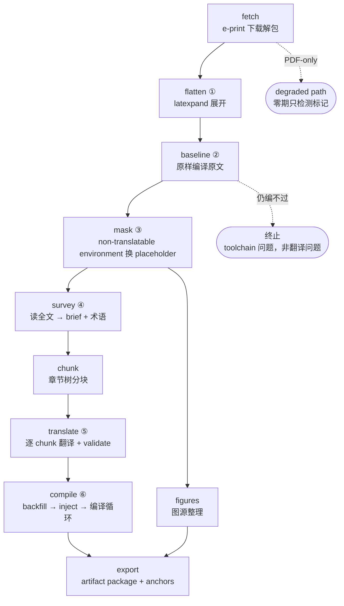

# 通途（Tongtu）架构文档

> 状态：草案 v0.9（2026-08-15）。本文是通途引擎的**工程级**权威文档。系统级设计（仓库边界、build/read 路径分离、artifact contract 的用途、分期计划）见文枢设计蓝图（内部工作区 `wenshu/docs/BLUEPRINT.md`；开源前把蓝图的引擎部分并入本文，使本文自足）；冲突时蓝图优先，或先改蓝图。
>
> artifact contract 由通途拥有：字段级定义以 §5 artifact contract 节与 `docs/schemas/` 为准，蓝图 §4.3 是摘要。

## 1. 定位与范围

通途是基于 LaTeX 源码的 arXiv 论文英译中引擎：确定性 pipeline + agent 翻译 + 脚本校验 + 编译循环，产出保真排版的中文 PDF 与结构化索引。仓库结构见 [README](../README.md)（`tongtu/`，含 `stages/` 与 `agent/` 子模块 / `skill/` / `docker/` / `fallback/` / `fonts/` / `ci/` / `docs/`）。

## 2. 设计原则

1. **agent 负责判断，脚本负责验证**。翻译、修编译错、适配非常规 documentclass 交给 agent；正确性只认校验脚本全绿与编译通过，agent 的「我检查过了」无效力。
2. **pipeline 是增量构建系统**。每阶段输出 = 输入（源码 + 配置 + 术语表 + prompt 版本 + 模型）的纯函数；输入未变不重算。返工 = 失效受影响的 chunk 并重算子图，粒度为 chunk；本模型下没有阶段级返工。
3. **控制流始终在脚本手里**。脚本只在固定介入点拉起 agent，介入点内部不限制其行为（多轮、执行命令、联网），结束判定一律是脚本校验。一次性问题由 agent 在介入点内就地解决，只记入 report；反复出现的问题**固化**为确定性代码或 SKILL 经验条目，判据是 report.json 的干预统计。编排层不积累一次性 hack。
4. **构建状态也是数据**（「会话 = 数据」的推广）。增量重翻所需状态（翻译记忆）随 artifact package 走，可在任何新环境续跑；工作目录的 `build/` 随时可丢。范围注明：随包走的构建状态只有翻译记忆；编译修复会话的成果零期不持久化，重编译 = 重新拉起修复会话（§4，附录 A.21）。
5. **纯本地操作**。通途只读写本地工作目录、stdout 与退出码；R2 上传、容器调度、任务队列全部是 wenshu 侧职责。接口形态固定为「文件 + CLI 约定」。

## 3. pipeline



带圈数字是 agent 介入点（见下表）。**LLM 支出从 survey 开始**，baseline 是它前面的 gate：原文编译不通过就终止，不产生任何 LLM 费用。mask 之后分成两支，figures 与翻译侧没有数据依赖，可同时跑（零期实际串行，见「边界与未决」）。

**所有阶段都由脚本驱动。** 脚本拉起 agent 只有两个原语，签名与约束见下文 agent 适配层节：

- `complete(prompt, text, model) -> text`：无状态判断，用于主文件判定、环境分类与术语决策。
- `session(prompt, workdir, model, budget) -> {done, transcript_path}`：有状态会话，用于逐 chunk 翻译与各类修复，可读写 workdir、执行命令、联网。

表中「agent 介入点」指：该阶段的脚本在特定触发条件下拉起一次有明确结束判定的 agent 调用，拿回结果后由脚本校验与推进，控制流不移交。「结束判定」一列是每个阶段完成与否的判定条件；有 agent 调用的阶段，这一判定同样由脚本做出。

| 阶段 | 描述 | agent 介入点（触发 → 授权） | 结束判定 |
|---|---|---|---|
| fetch | e-print 下载解包；PDF-only 检测 | — | 源码树落 `src/`（PDF-only → 报错标记 degraded path） |
| flatten | latexpand 展开 | 主文件歧义 → 判定主文件 ① | 单文件 `flat.tex` |
| baseline | latexmk 原样编译原文，隔离 toolchain 问题 | 失败 → workdir 内修 toolchain ② | 原文 PDF 编译通过；仍失败 → 终止（toolchain 问题，非翻译问题） |
| mask | 把 non-translatable environment、注释、caption 换成 placeholder，只留需要翻译的文本 | 未知环境 → text/non-translatable environment 分类 ③；不确定 → 保守整体掩码 | `unmask(mask(x)) == x` 恒等；`blocks.json` 完整 |
| survey | 一次读完全文，产出 outline 与术语决策，供后续每个 chunk 复用 | 读完全文 → outline（brief）生成 + 术语预扫与新词译法决策 ④（`complete`） | `brief.json` 与结构化术语表通过 schema 校验 |
| chunk | 章节树优先分块：`\section` 为首选单元，小节聚合至 soft limit token 数，超大节在小节/段落边界下分至 hard limit；绝不切入环境或段落内部 | — | chunk 清单（每个 chunk = 完整段落序列） |
| translate | chunk 循环、上下文组装、缓存查询；每个 chunk 拉起一次会话，出口跑 validate 终审 | 单 chunk 翻译（`session` 原语）⑤ | validate 全绿（placeholder / control sequence multiset / 括号与 inline math / 段落数） |
| compile | 脚本 backfill 与 inject 出一份可编译的起点，编译修复交给会话（工具面见 compile 节） | 编译不过 → 修复会话 ⑥（会话内可调 retranslate 复用⑤） | `zh.pdf` 存在、非空、页数与 baseline 相当、日志无 CJK missing glyph（回退段记入 report，保证总能产出 PDF） |
| figures | 图源整理：位图原样带走，矢量转位图并保留原件；caption 与引用段落收集。**只读 `src/` 与 `blocks.json`，不依赖翻译侧 artifact，可同时跑** | — | 图文件 + 元数据齐全 |
| export | artifact package 组装；anchors 三来源（synctex / blocks / pdf-scan）合成；caption 译文并入 figures 元数据；inspection page 生成；schema 自校验 | — | 契约 schema 校验通过 |

六个介入点（主文件、toolchain、环境分类、读全文与术语、翻译、适配与修复）覆盖论文之间的少见差异。**阶段图对所有论文相同**，PDF-only 在顶层分支到 degraded path，阶段序列本身不重排。

### agent 适配层 —— 两个原语，运行时可插拔

代码在 `agent/` 子模块，运行时选型未定（见蓝图 §4.4），流水线只依赖这层接口：

```
complete(prompt, text, model) -> text
    # 无状态判断：主文件判定、环境分类、读全文与术语决策。

session(prompt, workdir, model, budget) -> {done, transcript_path}
    # 有状态会话：逐 chunk 翻译、修 toolchain、修编译错、documentclass 适配。
    # 要求：headless 拉起、读写 workdir、执行命令、联网、可指定模型。
```

- `session` 的 `done` 只表示会话结束；**终审权在事后的校验脚本与编译**，不采信 agent 的自述。
- 翻译场景下脚本给出 chunk 文件与译文输出路径，agent 在会话内自行翻译、跑 `tongtu validate`、按输出修改，写完退出；脚本读文件再跑一遍 validate 做终审（translate 节）。
- 编译场景下 agent 不直接访问文件系统，读写 `zh.tex`、编译、看渲染页、回退或重译都经由 `tongtu tex …` 工具面，动作与 metadata 一并记账（compile 节）。
- 会话 trace 落 `logs/`：start-state hash + command sequence（参数、返回、耗时与 token）+ end-state hash。它既是审计记录，也是固化规则（§2 原则 3）的原料。
- **MockAgent**：`complete` 原样返回；`session` 在翻译场景把原文写到译文路径，在编译场景调一次 `tex compile` 后退出。CI 编译层（§7）依赖它。

### mask —— 把不该翻译的部分换成 placeholder

**要解决的问题**：模型有可能改坏不该改的文本。公式里的 `\alpha` 被当成词翻译，表格的 `&` 造成对齐错位，`\label` 被改名，这类错误要到编译阶段才暴露。mask 在交给模型之前把这些部分整块摘出去，只留下需要翻译的文本；摘出去的内容逐字节存进 `blocks.json`，翻完原样填回。

**输入 → 输出**：`build/flat.tex` → `build/masked.tex`（带掩码的原文，交给 LLM 翻译）+ `blocks.json`（被摘出去的 block）。两者在同一次遍历中产出，backfill 时以 `blocks.json` 为准。

```latex
% flat.tex
Figure~\ref{fig:arch} shows the pipeline.
\begin{figure}[t]
  \includegraphics{arch.pdf}
  \caption{System overview.}
\end{figure}
% TODO: cite the original paper here
The loss is $\mathcal{L} = \sum_i \ell_i$.
```

```latex
% masked.tex
Figure~\ref{fig:arch} shows the pipeline.
⟦BLK-7⟧
⟦CAP-2⟧ System overview.
⟦BLK-8⟧
The loss is $\mathcal{L} = \sum_i \ell_i$.
```

注意：
- `\ref` 与 inline math 留在原文中：它们是句子的组成部分，掩掉模型就读不懂这句话了。完整性交给外层 safety net（本节第 4 条）
- 整个 figure 被写成 `⟦BLK-7⟧`，但它内部的 caption 被摘出来，变成单独一行 `⟦CAP-2⟧`——caption 是需要翻译的文本，需要被提炼出来
- 注释同样是一个 block（`⟦BLK-8⟧`）

**掩码同时划定翻译范围**：non-translatable environment 内部的文本一律不译——表格的表头与单元格、公式里的 `\text{…}` 都随所在 block 保留原文，换来的是对齐、数学与代码不可能被改坏。preamble 整体也是一个 block，从中抽出的可译槽位只有 abstract（个别文档类要求摘要写在 `\begin{document}` 之前）；`\title` 不抽成槽位，标题保留英文原题——找论文、对引用都靠原题。需要翻译的只有正文散文、caption 与摘要。

**通用性从哪来**。论文之间的 LaTeX 写法差异很大，mask 的可靠性不依赖解析规则覆盖全部情况，而由四层机制承担：

1. **词法解析**。LaTeX 的花括号嵌套与 verbatim 语义超出正则表达能力，mask 用 LaTeX lexer 识别环境与分组（解析器选型见附录 C）。
2. **枚举完备，分类保守**。解析器可以完备枚举文档中出现的全部 `\begin{X}` 环境名，这一步不需要先验知识（词法扫一遍即可，verbatim 体与注释里的 `\begin` 不计入）。分类才需要知识，来源按优先级四级下沉：文档自带的 `\newtheorem` / `\newenvironment` 声明 → 数据文件形式的分类表 → 介入点③由 agent 判断 → 保守默认，即整体掩码并记 `category=unknown`。保守默认的代价是该 block 不被翻译并记入 report，源码不受破坏。agent 的分类结论按固化规则（§2 原则 3）记入分类表。
3. **运行时往返自检**。mask 完成后立即 unmask 并与原文逐字节比对，恒等才放行，不等则报出首处差异。解析缺陷在第一次 LLM 调用之前暴露，且每篇论文都会跑这一遍。
4. **外层还有两道拦截**。即便有遗漏，validate 的 control sequence multiset 比对与编译循环仍会拦下，最后的 safety net 是回退原文。

**不设强制的「agent 复核掩码结果」步骤**：那是「自我验证不可信」的变体（复核通过的效力等同于「我检查过了」），且逐篇付费。脚本只在环境分类这一处需要判断的地方拉起 agent。

> 逐条实现机制见 `tongtu/stages/mask.py` 模块文档，字段定义见 `docs/schemas/blocks.schema.json`，决策见附录 A.10。

### survey —— 一次读完全文，产出全篇共享的上下文

**要解决的问题**：掩码与分块之后，翻译每个 chunk 时模型只看到一小段被挖空的正文，跨章节的记号约定、专名指称与语体因此容易失配。survey 花一次全文 token 读完论文，产出后续每个 chunk 都复用的共享上下文。

**输入 → 输出**：`build/masked.tex` 的 **survey view** + 三层合并后的 input glossary（§5 术语表节）→ `brief.json`（full-text outline）+ `glossary.json`（本篇术语表）。brief 里有原文 abstract、章节结构树与每节摘要、记号约定、专名的统一指称方式、本篇 register。

术语表既是输入也是约束：已有条目直接生效，survey 只对表里没有的词做新决策，新决策叠在 input glossary 上，用户条目优先（§5 术语表节）。

survey view 不是 masked.tex 原样，而是按 block 类型参数化 backfill，组织成比原文干净，但同样信息丰富的形式：

- 数学类 block（equation、align 等）、表格、算法 backfill 原文：记号定义大多写在行间公式与算法体里，brief 的「记号与命名约定」正需要它们；表头与行列标签是方法名、数据集名、指标名的密集来源，术语预扫要靠它们
- 图、tikz、verbatim 保持 placeholder：绘图指令与代码本身不含读全文所需的信息，却占掉大量 token（图要表达什么写在 caption 里，而 caption 在 masked.tex 中本就可见）
- 附录与参考文献整段剔除；附录不进这一遍读全文，但后续仍正常翻译

正文规模因此可控，一次读完全文即可，不需要先分 chunk 后汇总。

**关键取舍**：

- **abstract 取原文，不取译文**。用译文会让全部 chunk 对它形成级联依赖，改一次摘要译文就要 full retranslation。这一段由程序从源码里取，不让模型抄一遍，省 token 也避免被改写。
- **术语预扫与 outline 在同一次读全文中完成**。两者都要读完全文，分成两个阶段就要付两次全文 token。
- **chunk 间一致性靠 brief 与术语表，不靠链式传译文**。前一个 chunk 的译文若进后一个 chunk 的提示词，cache invalidation 会顺着 chunk 的先后顺序一路传下去，并行翻译退化为串行。
- **brief.json 不阻塞 pipeline**。模型返回的 JSON 解析失败就把错误喂回去重试一次；仍失败则 degrade 为确定性骨架，章节树从标题命令扫出来、abstract 照录、其余留空，记 `degraded=True` 与 warnings，pipeline 继续往下走。

survey 与 mask 的环境分类是 pipeline 上最早的 LLM 支出，两者都排在 baseline 编译通过之后：原文编译不通过的论文不产生 LLM 费用。

> 逐条实现机制见 `tongtu/stages/survey.py` 模块文档，字段定义见 `docs/schemas/brief.schema.json`，决策见附录 A.11。

### chunk —— 决定一次翻译多大一个 chunk

**要解决的问题**：一次交给模型多少内容。chunk 小了切断节内衔接，而节内衔接是翻译质量的主要来源；chunk 大了单次生成会风格漂移、偷工减料、触及输出上限。

**输入 → 输出**：`build/masked.tex` → chunk 清单（`build/chunks/<id>.tex` 与 manifest）。chunk 首尾相接，拼起来逐字节等于 masked.tex，compile 的 backfill 与按 chunk 定位依赖这一条。

**怎么分**：

1. **章节树优先**。全文最浅的标题层级（一般是 `\section`，book 类是 `\chapter`）为首选单元。相邻小节按文档顺序聚合到 soft limit token 数；超大节在子标题边界下分（`\subsection` → `\subsubsection`），仍超限才退到段落边界。
2. **不切入环境或段落内部**。掩码流里 non-translatable environment 已是 placeholder，但文本环境（itemize、定理环境）原样留着，内部可能含空行；分段器带环境深度计数，深度大于 0 的空行不分段。单个段落即使超过 hard limit 也独占一个 chunk，不被切开。
3. **first chunk 与附录自成一体**。`\section` 之前的正文（前导正文与摘要的 caption 行）成为 first chunk，不与正文章节聚合；`\appendix` 之后的 chunk 标记 `is_appendix`，也不与正文 chunk 聚合。
4. **stray chunk 并入前一个 chunk**。聚合完成后从后往前扫一遍，token 数低于 `tail_min`（默认 soft limit 的四分之一）的 chunk 并入前一个 chunk，条件是同属正文或同属附录、两者都不是 first chunk、合并后不超 hard limit。倒序遍历使连续 stray chunk 能级联合并。最常触发它的是文末的致谢与结论。

soft limit 4000 / hard limit 8000（掩码后文本 token 计）是起步值，待 fixture 校准（附录 B 第 1 条）。token 数由零依赖近似估算得出，只用于分块决策，不进缓存 key，也不做预算承诺。

**关键取舍**：

- **chunk 大，定位与回退单元小**，两者由段落数比对解耦。节间衔接在论文中本来就弱（每节相对独立），需要跨节保持一致的只有术语与记号，交给 glossary 与 brief。
- **约束粒度的是输出，不是输入**。译文长度约等于原文，所以上限设在输出侧：soft limit（小节聚合）与 hard limit（超大节下分）。
- **chunk 变大不会让回退粒度变粗**。validate 强制原译段落一一对应，任何 chunk 都可确定性拆回段落对，于是回退原文的单位是段落而不是整节——编译修复会话里只回退出问题的那一段，同 chunk 其余段落照旧。

> 逐条实现机制见 `tongtu/stages/chunk.py` 模块文档，决策见附录 A.12。

### translate —— 按 chunk 逐一翻译，结构一致由 validation 判定

**要解决的问题**：把每个 chunk 译成中文，同时保证译文与原文结构完全一致。placeholder 少一个、control sequence 多一个、两段被并成一段，backfill 之后都会编译失败或丢内容，而模型的「我检查过了」在这里没有效力。

**输入 → 输出**：chunk 正文 + brief + 命中术语 + neighboring context → 译文 chunk + `chunks.json`（翻译记忆）。brief、术语表与 `style_version` 都是 survey 的 artifact。

**循环归 agent，终审归脚本**：

```
chunk 循环 → 查缓存 →（未命中）组装上下文 → 拉起会话（介入点⑤）
                                              │
              agent 自跑：翻译 → tongtu validate → 按输出修改 → 退出
                                              │
                              脚本读译文，再跑一遍 validate
                                   ├ 通过 → 写入缓存与 chunks.json
                                   └ 不通过 → 该 chunk 回退原文，记 status="fallback"
```

**validate 的四层**，全部机械，不含判断：

1. **placeholder**：`⟦BLK-3⟧` / `⟦CAP-2⟧` multiset 相等，外加残缺自检（`⟦` 与 `⟧` 的数量必须与完整 placeholder 数吻合，拦截 `⟦BLK-3⟧⟧` 这类碎片）
2. **control sequence**：`\cmd`（含星号变体）与 `\符号` multiset 相等
3. **括号与 inline math**：未转义的 `{` `}` `$` 计数分别相等
4. **段落数**：空行分段的段落数相等，防简译与跳段

层名与 `report.schema.json` 的 `validation.failures_by_check` 键一一对应。validate 同时是 CLI 子命令 `tongtu validate`，agent 在会话内调的与脚本在出口调的是同一份实现。

**关键取舍**：

- **重试循环不由脚本驱动**。agent 在会话内翻译、跑 validate、按输出改，改到自己认为可以为止；脚本不采信这个判断，会话退出后自己再跑一遍 validate 终审。
- **缓存查询在拉起会话之前**。命中直接取译文，不拉 agent。缓存粒度是 chunk，所以必须保持一个 chunk 一次调用；把整篇交给一次会话会让 incremental retranslation 退化为全量（§4）。
- **空白由驱动器保管**。送进会话的是去掉首尾空白的 chunk 正文，写回时由代码把首尾空白原样接上。译文 chunk 拼接后的形状因此由代码保证，而不是指望模型不动空白；validate 也只比对正文，段落数这一层才不会被首尾换行搅混。
- **neighboring context 只用原文**。前一个 chunk 的译文不进后一个 chunk 的提示词，理由见 survey 节。
- **术语一致性零期不进 validate**。四层校验只管结构；命中术语是否用了 canonical translation、不译词是否原样保留，零期靠提示词与 cache invalidation（§4）约束，不设机械校验——代价是编辑术语触发的 incremental retranslation 没有机械手段确认新译法真的生效。将来若加，方向是不译词的保留作硬判据、canonical translation 作 report warning。
- **出口 validate 与会话内的重译共用一份实现**。编译修复会话调 `tex retranslate` 时走同一个 validate，否则编译阶段救活的那一段就绕过了 validation。
- **不通过不终止 pipeline**。该 chunk 回退原文并记入 report，与 compile 里 `fallback` 是同一条纪律：保证总能产出 PDF。

> 缓存 key 构成见 §4，原语定义见 agent 适配层节，决策见附录 A.15。

### compile —— backfill、inject，然后交给会话编到出 PDF

**要解决的问题**：译文是掩码流，不能直接编译；英文 preamble 排不出中文；而编译错误的种类是开放的，package 冲突、字体缺失、float 溢出、documentclass 不认识的选项，每篇论文遇到的都不一样。更麻烦的是「编译通过」不等于「排得对」：tofu、图跑飞、双栏串行、line breaking 难看，这些只有看渲染结果才知道。

**输入 → 输出**：译文 chunk + `blocks.json` → `zh.tex` + `zh.pdf` + `build/zh-spans.json`（每个 chunk 在 `zh.tex` 里的字符区间，export 的 anchors 消费）。

**三段职责**：

1. **脚本产出起点**：unmask backfill（placeholder 换回原始 TeX，中间 artifact `zh-raw.tex` 落 `build/` 供调试）、inject_cjk inject（xeCJK 与 font fallback chain，查 documentclass 适配表）、组装 `build/zh/`。这一段是确定性的，交出一份可编译的 `zh.tex` 与已知的 chunk 区间。backfill 本就要逐个判定 caption 槽位是否被翻译（未改动的槽位 backfill 原文），译过的顺手落一份 caption 译文中间 artifact，供 export 并入 figures 元数据（figures 节）。
2. **会话编译修复**（介入点⑥）：agent 编译、读日志、看渲染页、改、再编，直到它认为可以。全部动作经由工具面，不直接碰文件系统。
3. **脚本终审出口**：`zh.pdf` 存在、非空、页数与 baseline 相当、日志无 CJK missing glyph。agent 的自述不作数。

**missing glyph 是硬判据**。xelatex 遇到字体里没有的字形会直接丢掉——这就是 tofu 的来源——只在日志留一行 `Missing character`，前提是 `\tracinglostchars ≥ 2`；2021 年后的 LaTeX 内核默认即 2，inject_cjk 仍在 preamble 显式写入 `\tracinglostchars=2`，不依赖内核版本。出口脚本扫描日志：missing glyph 落在 CJK 区段（含全角标点）→ 判失败——它只有 font fallback chain 没接上一个原因，而页数判据看不见它；非 CJK missing glyph、`Overfull \hbox` 行数与未定义引用数则取相对 baseline 的增量，进 report 作 warning，不设硬门——「多难看才算坏」没有机械答案，这部分仍靠会话内 agent 看渲染页。检查与 §7 pseudo-translation e2e 的 missing glyph 断言共用一份实现，与 validate 的三个调用方是同一条纪律。

**工具面**：会话内只有这几个动作，`zh.tex` 与编译日志之外的文件 agent 看不到。

```
tongtu tex read [--preamble | --chunk <id> | --lines A-B]
tongtu tex patch --old <文本> --new <文本>          # preamble
tongtu tex patch --chunk <id> --old … --new …      # 正文，该 chunk 状态记 edited
tongtu tex compile                                  # 编译一次，返回错误列表与日志摘要
tongtu tex render --page N                          # 渲染某页为图，供 agent 看排版
tongtu tex fallback <chunk-id> [--paragraph N]      # 该段回退原文
tongtu tex retranslate <chunk-id>                   # 重译一次（复用介入点⑤）
```

**按区域分区权限，metadata 只来自显式动作**：

- preamble（`\begin{document}` 之前）可以自由 patch。编译错误的绝大多数修复落在这里，而这些改动与 chunk 状态无关。
- 正文的每一次变化都对应一个语义明确的动作：`fallback`、`retranslate`，或标注了 `--chunk` 的 patch。动作发生时直接写 `chunks.json` 的 status（`translated` / `fallback` / `edited`）与 report。

`chunks.json` 与 report 因此不必从 `zh.tex` 反推。文本差异记得住「改了什么」，记不住「这个改动意味着什么」，而 status 要的正是后者。

**关键取舍**：

- **除 budget 外不限制 agent 的动作**。修复手段是开放集合（加 package、删冲突 package、调 float 参数、换字体、改 `\textwidth`），枚举我们想得到的动作只会在没预料到的疑难情况上卡住 agent，而那正是最需要它的场合。唯一的约束是编译次数上限，超限即终止会话并记 report。
- **trace 即 command sequence**。start-state hash + command sequence（参数、返回、耗时与 token）+ end-state hash。确定性命令可重放，非确定性命令（`retranslate` 调模型、`compile` 产日志）记下返回值代入。这份记录是固化规则（§2 原则 3）的原料，也顺带完成 bypass detection：重放结果与 end-state hash 对不上，就说明有改动没走工具面。
- **`zh-spans.json` 由 patch 增量维护**。每次 patch 知道位置与前后长度差，chunk 区间随之更新，anchors 拿到的是精确输入而不是文本查找的猜测。
- **适配表是数据，不是代码**。`tongtu/data/documentclass.json` 是叠加层，让会话里反复出现的成功适配沉淀成数据条目（§2 原则 3），下一篇同类论文的起点就已经是对的。
- **保证总能出 PDF**。回退过的段落记入 report.json，所以「编译通过」不等于「全篇都是译文」。

> **前提待验证**：工具面能否真正约束住 agent，取决于运行时可否配置成「只给指定工具、不给 shell」。若不能，退路是容器隔离，`zh.tex` 挂在容器外经 CLI 中转。见附录 B 第 7 条。

> 逐条实现机制见 `tongtu/stages/compile.py` 与 `inject_cjk.py` 模块文档，决策见附录 A.13 / A.16 / A.17 / A.18。

### figures —— 整理图源，供索引与下游渲染

**要解决的问题**：论文的图散在源码包各处，格式不一（PDF、EPS、PNG、JPG），而下游要拿它们做索引、给视觉模型读、在 markdown 或 typst 里渲染。同时要收集每张图的 caption 与「正文哪些段落引用了它」。

**输入 → 输出**：`src/` 的图源 + `blocks.json` 的图 block 与 caption 槽位 → 图文件 + 元数据。逐图以源文件 sha256 为缓存 key，与翻译状态无关。

**两条规则**：

- **源是位图（png / jpg / webp）→ 原样带走**。不转码、不缩放，元数据记原始尺寸。
- **源是矢量（pdf / eps）→ 转一份位图，同时保留矢量原件**。位图给必须吃位图的消费者（视觉模型只接受位图），矢量原件给需要清晰度或要自行转格式的下游。转换按固定 DPI（起步 150），不按固定长边。

输出因此是 png / jpg / webp / pdf 的混合，`format` 字段区分。

**这些图不是给 `zh.pdf` 用的**。xelatex 直接接受 PDF 图，EPS 经 epstopdf 链自动转换，编译侧无需处理。人要看高清走 `zh.pdf` 里内嵌的矢量原图。

**关键取舍**：

- **不在生产侧执行消费者的约束**。视觉 API 的长边上限（约 1568px）是那一个消费者的数字，焊进 artifact package 意味着换个消费者就要重新生成，而位图源缩过之后原图信息找不回来。需要缩的一方自己缩。
- **不依赖翻译侧 artifact**。只读 `src/` 与 `blocks.json`，翻译侧任何返工都不触发重渲染，这是 figures 独立成阶段的理由（§4）。引用段落从掩码流扫 `\ref` 家族映射回段落，掩码流缺席时该字段留空。
- **caption 译文由 export 并入**。本阶段元数据里的 caption 取自 `blocks.json`，是原文；译后 caption 埋在某个 chunk 译文的掩码流里，边界只有 unmask 知道，不该让包外消费者解析掩码流。compile backfill 时顺手落出的 caption 译文中间 artifact（compile 节），由 export 组装时并入 figures 元数据——figures 阶段与逐图缓存不受翻译返工影响的性质不变。
- **渲染工具是 toolchain 要求，不是可选项**。矢量转位图要 pdftocairo / epstopdf，它们与 xelatex 同级，由 `tongtu doctor` 检查、`run` 开跑前校验，缺了就报错。不做静默 degrade：一张没渲出来的图会让 artifact 默默缺内容，而调用方看不出区别。

**引用与配对的口径**：`\includegraphics` 的每一次出现算一条记录（subfigure 因此产出多条，共享 `block_id`）。文件名按 LaTeX 的规矩解析——有已知扩展名就用它，否则按 pdf → png → jpg 的顺序在 `src/` 与 `\graphicspath` 目录里试。caption 按 block 内位置配对：图对应其后第一个必选 caption 槽位，`[短标题]` 不参与配对；label 取本图与下一张图之间的第一个 `\label`，没有则回落到 block 级 label。

> 逐条实现机制见 `tongtu/stages/figures.py` 模块文档，决策见附录 A.9 / A.19。

### 边界与未决

**degraded path 还没想**：PDF-only、`pdfpages` 套壳、非 arXiv 的 PDF 这三类，零期只在 fetch 阶段检测并标记，到此为止。degraded pipeline 的阶段与 artifact 形态都未设计，背景见 [`fallback/README.md`](../fallback/README.md)。

**并发还没想**：零期整条 pipeline 串行执行，chunk 级翻译与 figures 都没有并行。缓存 key 不含前一个 chunk 的译文（survey 节），为将来并行留了余地，但调度方式、并发度、失败重试与并发怎么交互都未设计。表中 figures 那格写的「可同时跑」指它与翻译侧没有数据依赖，不是现在真的同时在跑。

**开发者 safety net**：导致 pipeline 终止的疑难问题，零期的处理方式是开发者对着 workdir 开交互式 agent 会话排查；这属于开发者的排查手段，不做成产品功能。

## 4. 增量模型与缓存

**阶段级**：每阶段完成后在 `build/manifests/<stage>.json` 记录输入 hash 集与输出清单。重跑时输入未变 → 跳过。断点续跑 = 原样重跑同一条命令。

**chunk 级**（翻译缓存，也是唯一昂贵的一层）：

```
key = hash( norm(chunk_src)              # 空白规范化后的 chunk 源码
          + neighbor_src                # 提示词携带的 neighboring context（前后各若干段，随源码固定）
          + relevant_terms(chunk)       # glossary 术语条目中在本 chunk 命中的子集（排序）
          + brief_hash                  # survey 产出的 full-text outline 内容 hash
          + style_version               # 全局 style rules 版本号
          + prompt_version              # SKILL / prompt 资产版本
          + model_id )
```

术语表分两部分参与 key：**术语条目**按 chunk 内命中计入，改一个词只失效含它的 chunk；**全局 style rules** 单列 `style_version`，bump 即触发 full retranslation，是显式操作。

| 返工触发 | 失效范围 | 路径 |
|---|---|---|
| validate 失败 | 单 chunk | translate 内环重试 |
| 编译失败 | agent 在修复会话内定位到的 chunk 或段落 | 会话内 `retranslate`；仍不过则 `fallback` 回退原文 |
| 编辑某术语条目 | 命中该术语的 chunk | incremental retranslation → 重编译 |
| 改 style rules / 升级 prompt / 换模型 | 全部 chunk | 显式 full retranslation |
| 重跑 survey 且 brief 内容变化 | 全部 chunk | 显式操作（survey 自身按 manifest 缓存，输入未变不重跑，brief 不会意外漂移） |
| 改 pipeline 代码 | 对应阶段起的下游 | manifest 判定重算 |

**「重编译」在零期 = 重新拉起修复会话**。介入点⑥是非确定性会话，它的成果（preamble 适配）不是任何输入的函数，零期也不持久化：chunk 失效后的重编译从 unmask + inject 的新起点重来，上次会话修过的问题要重新修；`edited` chunk 被重翻覆盖后同理。把这件事变便宜是下一阶段的事：trace 即 command sequence、确定性命令可重放（附录 A.18），攒够真实论文的 trace 后，重编译可以先不拉会话、重放上次的确定性修复或命中已沉淀的适配表，失败再拉会话。取舍见附录 A.21，落地项见 BACKLOG。

**figures 逐图缓存**：以源图文件 hash 为 key，与翻译状态无关，翻译侧任何返工都不触发重渲染。

**不做跨论文全局缓存**：chunk 源码跨论文几乎不复用，去重价值≈0。缓存存放在该论文的工作目录内；权威翻译记忆是 artifact package 中的 `chunks.json`（见 §5 artifact contract 节），`build/` 整体删除不丢失任何昂贵成果。

**key 的构成会变，记忆不应作废**：`chunks.json` 每条记录都存着 key 的组成要素快照（源码 hash、术语快照、模型与 prompt 版本），在此之上加一个 `key_version`——key 构成算法自身的版本号。将来改 key 逻辑（brief 分字段参与、按要素降级匹配、非 arXiv 来源）时，从存好的要素对旧记忆重算新 key，翻译记忆平滑迁移。同一论文的版次更新（arXiv v2）今天没有增量语义：survey 重跑、brief 变，全部 chunk 失效——这个场景显式推迟（附录 B 第 10 条），`key_version` 是为它留的口子。

## 5. 数据面

### 目录约定

通途区分两类目录，均由环境变量覆盖、未设时给出固定默认值，不依赖操作系统的「标准目录」API（macOS 与 Linux 行为一致）：

| 用途 | 环境变量 | 默认路径 | 存放内容 |
|---|---|---|---|
| 数据目录 | `$TONGTU_HOME` | `~/.local/share/tongtu/` | 逐篇论文的工作目录（`src/` `build/` `out/` `logs/`，见下「工作目录布局」） |
| 配置目录 | `$XDG_CONFIG_HOME`（未设则退化为 `~/.config`） | `~/.config/tongtu/` | 跨论文的全局配置，目前只有全局术语表 `glossary.json` |

两者的区分标准是内容性质，不是路径来源：数据目录放的是运行产生的、和某一篇论文绑定的东西，配置目录放的是用户手改的、和论文无关的东西——这也是为什么全局术语表不进数据目录，论文的输入术语表反而和 `src/`、`build/`、`out/`、`logs/` 同级放在工作目录里（见下「术语表」节）。

`$XDG_CONFIG_HOME` 这个变量名沿用了 Linux 桌面 XDG Base Directory 规范的命名，但通途并未接入该规范的其余部分（如 `XDG_DATA_HOME`、`XDG_CACHE_HOME`），数据目录用的是通途自定的 `$TONGTU_HOME`，不是 `XDG_DATA_HOME`。选它只是因为大量命令行工具（而非 GUI 应用）已经把这个变量名当作事实标准，跟随它换不来兼容性代价。

### 工作目录布局

```
~/.local/share/tongtu/<arxiv_id>/     # $TONGTU_HOME / --workdir 覆盖；云容器内为 /work
├── src/          # e-print 原始解包，只读不改
├── build/        # pipeline 工作区，可整体删除（重建时从 out/chunks.json 命中缓存）
│   ├── flat.tex  baseline/  masked.tex  chunks/  zh/
│   └── manifests/
├── out/          # artifact package（见 artifact contract）
└── logs/         # agent 会话 trace、编译日志（审计与固化判据的数据来源）
```

### artifact contract（每篇论文一个 artifact package）

| artifact | 说明 |
|---|---|
| `zh.tex` | 翻译后完整 LaTeX 源（自包含 pack） |
| `zh.pdf` | xelatex 编译 artifact，主阅读格式 |
| `blocks.json` | 每个 non-translatable environment 的类型、label、原始 TeX、源码位置 |
| `anchors.json` | 交互地图：公式/图/表/章节在 PDF 中的页码与矩形区域 |
| `chunks.json` | **翻译记忆**：每个 chunk `源码hash → 译文 + 模型/prompt 版本/相关术语快照/状态(translated\|fallback\|edited)`，incremental retranslation 的全部状态，另记 `key_version`（缓存 key 构成算法的版本号，供将来重算 key 迁移记忆，§4）。`edited` = 编译修复会话内经标注 patch 改过的 chunk |
| `brief.json` | **full-text outline**：论文原文 abstract **照录**（不生成）+ 章节结构树与每节摘要、记号与命名约定、register。首要用途是按 chunk 翻译的全局上下文；随包分发后 read path 的 AI 摘要与会话预热可直接复用 |
| `figures/` + 元数据 | 图源整理 artifact：位图源（png/jpg/webp）原样带走，矢量源（pdf/eps）转一份位图并保留矢量原件（按固定 DPI，起步 150）；元数据含 caption（原文与译文，译文由 export 从 backfill 结果并入）、全文引用段落清单、原始尺寸与 `format` 字段 |
| `glossary.json` | 本篇 resolved glossary（含 agent 新决策） |
| `report.json` | 回退 chunk、校验统计、编译警告、agent 介入点的干预记录、契约版本号 |
| `report.html` | **inspection page**（见 inspection page 节） |
| `zh.synctex.gz` | 源码行 ↔ PDF 坐标映射 |

各 JSON artifact 以 `docs/schemas/*.schema.json` 为字段级权威定义，CI 对 artifact 做 schema 校验。契约变更需先改 schema 并 bump `contract_version`。

**跨版本兼容规则还没想**：旧 artifact package 能否被新版通途 incremental retranslation（`chunks.json` 是否跨版本可读）、wenshu 拿到不认识的 `contract_version` 该怎么办、版本号用 semver 还是单调整数，都未定。零期只有一个版本，先不处理。

### inspection page（`report.html`）

- **内容**：PDF.js 渲染 `zh.pdf`；anchors hotspot 画为半透明覆盖层，点击显示 `blocks.json` 中的原始 TeX；侧栏列 `report.json` 回退 chunk 与校验统计；figures PNG 索引。
- **完全静态自包含**：只消费 artifact package 内文件，PDF.js vendor 随包分发，无网络可开（双击或 `tongtu preview`）。
- **边界**：需要服务端或 LLM 调用的功能一律归文枢，本页不做。

### 术语表

- **预扫描、合并与新词决策统一发生在 survey 阶段**（§3 survey 节），与 full-text outline 在同一次读全文中完成。
- **三层合并**，后者覆盖前者：顺序为全局配置目录下的 `glossary.json`（见「目录约定」节）→ 论文目录内 input glossary `<workdir>/glossary.json`（与 `src/`/`build/`/`out/`/`logs/` 同级，**不放进 `src/`**：那是只读的 e-print 树，混入会污染 fetch 的树 hash）→ `--glossary` 命令行（可多次，靠后的优先）。合并语义：`terms` 条目级覆盖（同名后者胜）、`do_not_translate` 取并集、`style` 逐字段覆盖。
- **input glossary**（用户可编辑）与**resolved glossary**（artifact `glossary.json`，本篇实际生效决策）分离；用户条目优先于 agent 决策。
- 结构三段：do-not-translate list / 术语 canonical translation / style rules（`style_version` 所在，含译者注开关）。
- 云上传入：wenshu 把 R2 中的表落成文件递给容器，仍是「文件 + CLI」，不新增接口形态。

## 6. 调用与运行

接口的另一半：CLI 命令面，以及它对运行环境的要求。

### CLI 命令面（草案）

```
tongtu run <arxiv-id | dir>  [--glossary FILE]...  [--workdir DIR]  [--force]  [--json]
tongtu retranslate <id>  (--chunks c012,c045 | --term WORD | --all)
tongtu stage <name> <id>          # 单阶段入口，调试用
tongtu validate <src> <dst>       # 四层 validation，逐项报告失败
tongtu doctor                     # 检查 xelatex/latexmk/latexpand 与字体，逐项报告缺失
tongtu preview <id>               # 打开 inspection page
```

- `run` 幂等：重复执行按 manifest 与翻译缓存跳过已完成部分；`--force` 无视缓存 full rerun。
- `--json`：向 stdout 输出机器可读事件流（阶段起止、chunk 进度、最终结果）。它属于 wenshu 容器调度侧消费的 CLI 调用约定，schema 一期前冻结。
- 退出码：0 = artifact package 完整产出（含有回退 chunk 的情形，详情在 report.json）；非 0 = 未能出包。
- `validate` 有三个调用方，同一份实现：agent 在翻译会话内自查、脚本在出口终审、开发者手工排查（§3 translate 节）。
- 另有一组 `tongtu tex …` 是**编译修复会话的工具面**，不面向人：agent 通过它读写 `zh.tex`、编译、看渲染页、回退或重译某 chunk，动作与 metadata 一并记账。命令清单与分区权限规则见 §3 compile 节。
- `retranslate` 的失效语义见 §4 返工触发表。**边界行为还没想**：chunk id 写错、术语没命中任何 chunk、失效后要不要连带重编译，这些当前只有实现里的做法，没做设计。

### 运行环境

**本地原生是主形态**：CLI 只要求 PATH 中有 xelatex / latexmk / latexpand 及字体（探测链 Hiragino → Noto Sans CJK → 霞鹜文楷）。macOS 上 docker 经由虚拟机、bind mount IO 慢，开发迭代跑原生更快；`tongtu doctor` 弥补环境差异。

**docker 承担三个角色，均不是 CLI 运行前提**：

1. **云部署单元**：Cloudflare Containers 只认镜像；
2. **CI 环境**：TeX 发行版差异会造成实际的行为差别，CI 一律用镜像；
3. **参考环境**：「编译通过」以镜像内的结果为准，bug 报告与 artifact 合规都以镜像内复现为准。

镜像双层构建：TeX Live full 基底层（几乎不变，CI 层缓存常年命中）+ 通途代码层；GHCR 发布，git tag 即版本，wenshu 按 tag 引用。

已知 trade-off：本地原生运行没有容器隔离，而修复 agent 可以执行 bash。这与在本地日常运行 coding agent 是同一信任前提。将来可为修复 agent 增加受限权限选项。

## 7. 测试与 CI/CD

test pyramid，按成本分三层：

1. **文本层**（秒级；无 TeX、无 LLM）：mask / unmask / validate / chunk 皆为纯文本变换，golden-file 测试打底；外加 mask/unmask 往返恒等的性质测试，同一自检在生产环境对每篇论文运行时也会执行（§3 mask 节第 3 条）。正确性验证的主体在这一层。**PR 必过。**
2. **编译层**（分钟级；有 TeX、无 LLM）：**identity translation e2e**。MockAgent 原样返回源文、在编译会话里调一次 `tex compile` 即退出，三篇 fixture 论文全 pipeline 跑到底，产出 PDF + anchors 并通过 schema 校验。零 LLM 成本覆盖掩码、inject、编译循环、导出、索引全链路。**PR 必过。**
   identity translation 的译文不含中文，覆盖不到 xeCJK line breaking 等中文相关路径，所以同一批 fixture 再跑一遍 **pseudo-translation 变体**：`tongtu.agent.mock.PseudoAgent`（`get_agent("pseudo")`）给每个文本段前缀一句固定中文，零 LLM、零随机，删掉前缀即逐字节回到原文。前缀不含 `\` `{` `}` `$` `⟦` `⟧`，validate 四层因此逐项不变；结构行开头的段一律跳过，中文落在 `\documentclass` 前或首个 `\item` 前会造成真实的编译错误。`tests/test_e2e_pseudo.py` 与 identity translation e2e 同参数化，在真实 TeX 形态下断言含中文的 `zh.tex` 编出非空 PDF 且日志无 missing glyph（missing glyph 检查与 compile 出口共用一份实现，见 §3 compile 节）。不另造中文 fixture：同一批 fixture、同一条 pipeline，变体只换 agent。
3. **LLM 层**（**手动触发**；限预算）：真模型跑 1–3 篇，report.json 统计入 quality dashboard。**它只做质量监控，PR 不等它**：模型抖动不得卡 PR。暂不设 nightly（成本与收益不匹配）；待朝晖（hot-paper 自动发现）接入后，挂在其自动入队流上用真实论文流做 quality regression。

fixtures：自造最小模板论文（article / revtex / 双栏会议，各数页）入仓库；真实 arXiv 论文只在 LLM 层按需拉取、不入库，以保持 license 干净。

环境一致性：本地 = CI = 云，同一镜像（§6 运行环境节）；镜像 CI 按层缓存，tag 触发 GHCR 发布。

---

## 附录 A：决策记录

每条：**决策 / 曾考虑的替代 / 否决理由**。正面论证在正文对应小节，这里只记为什么不走另一条路。编号被代码注释与 schema 引用，只增不改。

1. **脚本编排，脚本在固定介入点拉起 agent。** 曾考虑：agent 为主体、SKILL 驱动流程（v2 形态）。否决理由：确定性控制流是缓存、断点续跑、CI 与可调试性（同一输入走同一条路径）的共同前提；一个流程能固化到写进 SKILL.md 的程度，就已经能固化成代码，而代码不会偷懒；让 agent 自由编排的三种失败模式（重复造轮子 / 偷工减料不可检测 / 自我验证不可信）在编排层同样成立。SKILL 因此降级为 prompt 资产。阶段图为什么对所有论文相同见 §3。
2. **返工 = chunk 级失效重算，不存在阶段级回跳。** 曾考虑：显式的阶段回退控制流。否决理由：全部返工场景（校验失败、编译失败、改术语表、改文风）都能归结为「失效受影响 chunk + 重算子图」，再给阶段回跳留位置就是两套机制并存。失效范围见 §4。
3. **翻译记忆入 artifact contract（`chunks.json`）。** 曾考虑：中间 artifact 全存 R2；全丢弃。否决理由：两者都没区分「可丢弃缓存」与「增量重翻所需状态」。后者随 artifact package 走，云上编辑术语表就是拉包 → 失效 → 只重翻受影响 chunk → 回传，容器保持一次性；全存 R2 等于把一次性容器变成有状态服务。
4. **通途不感知 R2 / Cloudflare。** 否决理由：开源 CLI 不能依赖特定云，上传与调度是 wenshu 侧职责。接口形态见 §2 原则 5。
5. **缓存 key 的构成，以及术语表分两部分参与。** 论证见 §4，此条只保留编号供引用。
6. **docker 为三角色（云部署 / CI / 参考环境），非运行前提；本地原生为主形态。** 曾考虑：强制 docker 运行。否决理由：CLI 对 toolchain 的全部要求是 TeX 在 PATH，强制容器只换来 macOS 上被虚拟机拖慢的编译迭代；环境确定性靠「终审权固定在参考镜像」就能拿到，不必牺牲本地速度；TeX Live 体积原生与镜像相当，无一方更省。三角色分工见 §6 运行环境节。
7. **test pyramid + identity translation 列为 PR 必过。** 曾考虑：LLM 层也设为 PR 必过。否决理由：模型抖动会变成 PR 阻塞，而 quality regression 不需要卡在合并路径上。identity translation 入选是因为它以零 LLM 成本覆盖编译全链路，相当于把零期交付判据搬进 CI。分层见 §7。
8. **inspection page 入 artifact package，通途不做前后端。** 曾考虑：给通途做独立前后端架构（展示 + 文枢完成前自用）。否决理由：backend 必然复制文枢的信箱职责，也会侵蚀「artifact contract + CLI」这条仓库边界；零期的真实需求静态页已经全部满足；交互阅读器若要提前，就提前动工文枢 web 端读本地 artifact package，不在通途另起炉灶。用途与边界见 §5 inspection page 节。
9. **figures 独立成阶段，不依赖翻译侧 artifact。** 曾考虑：并入 export。否决理由：并入之后翻译侧的任何返工都会连带触发图片重渲染，只有独立 manifest 加逐图 hash 缓存才切得断这条依赖。「PDF/EPS 图无法用于 artifact」的顾虑为什么不成立见 §3 figures 节。
10. **mask = 解析器 + 分类表 + 保守默认 + 往返自检，不设强制 agent 复核。** 曾考虑：正则匹配；agent 复核掩码结果。否决理由：LaTeX 不是正则语言，正则方案先天不成立；agent 复核是「自我验证不可信」的变体（复核通过的效力等同于「我检查过了」），且逐篇付费。四层机制见 §3 mask 节。
11. **survey 阶段：一次读完全文产出 brief + 术语，一致性靠稳定的共享上下文。** 曾考虑：无全局上下文逐 chunk 直译；glossary 独立成阶段；前一个 chunk 的译文链式传入后一个 chunk 的提示词。否决理由：逐 chunk 直译挡不住跨章节的记号、指称与语体漂移，而术语表只能约束词这类硬指标；glossary 独立成阶段要再付一次全文 token，它与 outline 同属「读全文一次」的 artifact；链式传入译文会让 cache invalidation 顺着 chunk 的先后顺序一路传下去，并行退化为串行。读全文的输入与产出见 §3。
12. **章节优先的大 chunk 分块，翻译粒度与回退粒度解耦。** 曾考虑：段落级小 chunk；固定 token 窗口切割。否决理由：小 chunk 切断节内衔接，而节内衔接是翻译质量的主要来源；固定窗口会切进环境或段落内部。代价是编辑术语时会失效整节，token 成本可接受。粒度约束见 §3。
13. **assemble 并入 compile，「documentclass 适配」与「编译修复」合为一个介入点。** 曾考虑：独立 assemble 阶段（unmask + inject_cjk）。否决理由：原 assemble 的结束判定一栏写的是「终审权在 compile」，而没有自身结束判定的阶段在本模型下不构成独立阶段；修复会话的常见动作是「改 inject 配置/preamble → 重编译」，这个循环本身跨越两者，合并后它在单一阶段驱动器内闭合；unmask + inject 是廉价文本操作，无独立缓存价值，中间 artifact `zh-raw.tex` 仍落 `build/` 供调试。适配与修复并成一个介入点，是因为它们是同一件事（让这个 documentclass 编译通过）、同一个终审方式（编译循环）。
14. **figures 单格式 PNG + 按视觉模型上限定长边，暂不做 WebP/GIF/SVG。** 曾考虑：多格式兼容（webp/gif/svg）。否决理由：「分辨率高则体积大、体积小则模糊」属于分辨率策略，与格式无关；GIF 色深劣于 PNG；SVG 视觉 API 不接受，PDF→SVG 转换的保真度问题也多，矢量需求已由 zh.pdf 承担；WebP 的收益只在存储与传输体积，留作后续优化，元数据 `format` 字段已预留。人看高清走 zh.pdf 内嵌的矢量原图，不需要独立的高清位图。**本条已被 A.19 取代。**
15. **翻译内环交给 agent 自跑，脚本只在出口终审。** 曾考虑：脚本驱动重试，即用无状态的 `complete` 单次调用，拿回译文后由脚本跑 validate、把错误格式化后喂回提示词，至多 N 次。否决理由：那等于我们代替 agent 读工具输出，而 agent 运行时本来就能执行命令；重试计数、错误转译、`max_retries` 都是编排层为此维护的机械代码。§2 原则 3 本来就允许介入点内部多轮与执行命令，脚本驱动重试是实现选择而非原则要求，改用会话原语不移交控制流：脚本仍决定何时拉起、拉起几次，出口仍由 validate 终审，不过则该 chunk 回退原文。代价是每个 chunk 一次会话的拉起开销大于单次调用，需实测（见 BACKLOG）。缓存与回退粒度不随之改变：缓存查询在拉起会话之前，一个 chunk 一次调用的约束不变。
16. **compile 的编译修复交给 agent 主导。** 曾考虑：脚本 triage（全局问题 vs 坏段）+ chunk→段落两级 bisection localization + 「译文错误数不超过原文」的放宽判据。否决理由：编译错误是开放集合，为每一类写 triage 规则没有尽头；bisection localization 是拿算力换判断力，每次探测烧一次编译，而 agent 读日志行号往往一步到位；更根本的是「编译通过」不等于「排得对」，tofu、图跑飞、双栏串行只有看渲染结果才知道，脚本没有这个能力。脚本保留的是确定性起点（backfill 与 inject）与出口终审。
17. **agent 经 CLI 工具面读写 `zh.tex`，按区域分区权限。** 曾考虑：给 agent 文件系统访问，事后 diff 推断发生了什么。否决理由：文本差异记得住「改了什么」，记不住「这个改动意味着什么」——某段被改回英文与某段被重写，在 diff 里长得一样，而 `chunks.json` 的 status 要的正是语义。metadata 因此只来自显式动作：preamble 自由 patch，正文的每次变化对应 `fallback` / `retranslate` / 标注了 chunk 的 patch。工具面同时限定 agent 能读到什么，顺带控制上下文开销。
18. **trace = start-state hash + command sequence + end-state hash，不存 diff。** 曾考虑：记录每次会话对工作目录的改动 diff。否决理由：command sequence 本身就是改动的完整描述（`patch --old X --new Y` 即那次改动），起点加序列可重放出任何中间状态，另存差异只是同一信息的第二份拷贝，还多一处可能对不上的地方；command sequence 还带着 agent 的意图，而 `fallback` 与 `patch` 在 diff 里无从分辨，固化规则要总结的恰恰是意图。非确定性命令记返回值代入重放。bypass detection 随之免费：重放结果与 end-state hash 不符，即说明有改动没走工具面。
19. **figures 保留矢量原件 + 位图，不统一成单一格式。** 曾考虑：全部转 PNG 并按视觉模型上限（≈1568px）定 DPI（即本文 A.14）；一并支持 SVG。否决理由：A.14 的论证建立在「消费者只有视觉模型与 inspection page」这个假设上，而下游还包括 markdown 与 typst 渲染；1568px 是其中一个消费者的数字，焊进 artifact package 意味着换消费者就要重新生成，位图源缩过之后原图信息也找不回来。SVG 暂不做，因为 PDF→SVG 的保真度未经实测（字体转路径则体积大且文字不可选，依赖字体可用则可能出现 missing glyph），而保留 PDF 原件已覆盖需要矢量的场景，下游要 SVG 可自行转换。
20. **compile 出口加 missing glyph 硬判据，排版质量的其余维度记 warning 不设门。** 曾考虑：出口只查页数，排版质量全部交给会话内 agent 看渲染页。否决理由：那让「排得对」的最终终审落在 agent 自述上，与原则 1 冲突，而 missing glyph 恰好机械可查——`\tracinglostchars=2` 之下每个丢掉的字形都在日志留 `Missing character` 一行，CJK missing glyph 只有 font fallback chain 没接上一个原因，页数判据看不见它，出来的 PDF 必然带 tofu。overfull 与未定义引用的 baseline 增量同样免费，但「多难看才算坏」没有机械答案，只记 report 不拦产出。机制见 §3 compile 节。
21. **编译修复成果零期不持久化，重编译 = 重新拉起修复会话。** 曾考虑：把修复后的 preamble（或 patch 集）纳入状态资产，随 artifact package 走，重编译从已修复状态起步。否决理由：方案本身成立，但零期没有真实论文的修复 trace，不知道持久化成什么形态才对（patch 集、终态 preamble、还是适配表条目），先按最简单的语义跑，代价是重复的会话开销。攒够 trace 后走更便宜的路线：重编译先重放上次会话的确定性命令或命中适配表（A.18 的 trace 本就可重放），失败再拉会话。原则 4 的「构建状态也是数据」范围因此注明只含翻译记忆。语义见 §4。

## 附录 B：Open Questions

多为实测校准项，非设计阻塞。已定的条目落入正文，编号保留供代码引用。

1. **chunk soft limit / hard limit 的具体数值**（掩码后文本 token 计）：软 ~4k、硬 ~8k 起步，三篇 fixture 校准（观测指标：validate 重试率、长生成漂移、术语一致性）。
2. **identity translation 的中文路径覆盖**：曾在 pseudo-translation 变体与专门的中文 fixture 之间取舍。**已定**（零期收尾）：pseudo-translation 变体，见 §7 第 2 层。
3. **`--json` 事件流 schema**：一期容器调度前冻结，零期先出草案。
4. **anchors 三来源叠加的实现次序与 hotspot 容差**：零期拿真实论文实测后定。M4 已把它们收成 `tongtu/anchors.py` 的模块级常量（`SOURCE_PRIORITY` / `RECT_PADDING_PT` / `BAND_MERGE_TOLERANCE_PT` / `SYNCTEX_SCALE` 与页级降级的页码估计），改一个数即可重新校准；synctex 缺席时一律退化为页级锚点并如实标注 `source` 与 `confidence`，不伪造精确矩形。
5. **brief 各字段粒度与 neighboring context 段数**：三篇 fixture 校准。
6. **survey view 的 token 规模**：数学类 block 之外再 backfill 表格与算法（§3 survey 节）会明显增大读全文输入，大结果表尤甚。三篇 fixture 实测读全文输入 token 数，确认「一次读全文即可，不做 map-reduce」在常见论文规模下成立。若超出预算，可选的收缩手段有：表格只 backfill 表头与首列、超长表格按阈值降级回 placeholder。
7. **agent 运行时能否只给指定工具、不给 shell**：§3 compile 节的工具面约束以此为前提。Codex CLI 的配置能力待验证；若做不到，退路是容器隔离（`zh.tex` 挂在容器外，经 CLI 中转），但那样本地开发也要跑容器，与 §6 运行环境节「本地原生为主」有张力。
8. **编译修复会话的 budget**：编译次数上限，开发阶段起步 30 次，拿真实论文的次数分布校准。
9. **SVG 是否加进 figures 输出**：pdf2svg / mutool convert 在三篇 fixture 上的保真度（字体处理、透明度、裁剪路径）决定取舍，见附录 A.19。
10. **同一论文版次更新的 incremental retranslation**：arXiv v2 出来后 survey 重跑、brief 变，全部 chunk 失效，翻译记忆等于归零。显式推迟：当前读的以老论文为主，场景还没出现过；`chunks.json` 的要素快照与 `key_version`（§4）已为它留了迁移口子，且不绑 arXiv——将来非 arXiv 来源同样适用。真实遇到追新版的需求再设计，可选方向：brief 分字段参与 key、记忆按要素降级匹配。

## 附录 C：选型清单

| 组件 | 选型 |
|---|---|
| CLI 语言与依赖管理 | Python 3 + uv（尽量保持 v2 脚本零第三方依赖的做法） |
| mask 解析器 | 自研零依赖词法状态机（继承 v2；TexSoup 在真实论文上 parse 失败率高，已弃用，pylatexenc 备选），叠加往返自检 |
| agent 运行时 | 首发用 Codex CLI，两个原语都走运行时。适配层（§3 agent 适配层节）隔离，切换零成本 |
| 编译 | latexmk -xelatex -interaction=nonstopmode |
| 镜像 | TeX Live full（~6GB 不裁剪：package 需求不可预测，为省磁盘而引入新的失败类型不划算，继承 v2 结论） |
| inspection page | PDF.js vendor 随 artifact package（优先自包含，体积成问题再调整） |
| 代码检查与格式化 | ruff（lint + format），配置在 `pyproject.toml` 的 `[tool.ruff]`；`pre-commit` 管本地 git hook，`.pre-commit-config.yaml` 的 hook 一律经 `uv run` 调用项目环境里的工具，版本以 `pyproject.toml` / `uv.lock` 为唯一源；CI 跑同一组命令（§7 测试与 CI/CD 节） |
